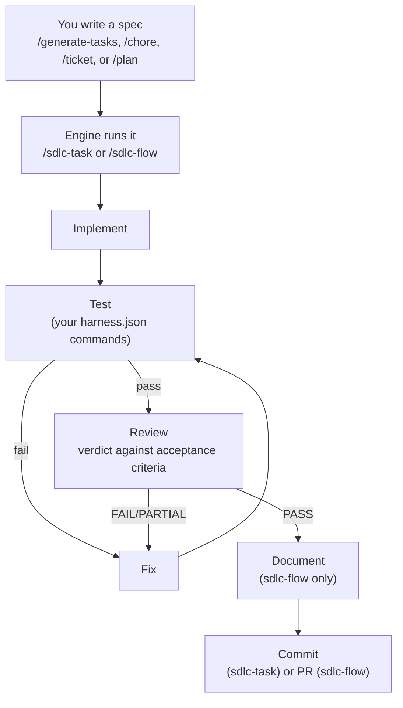
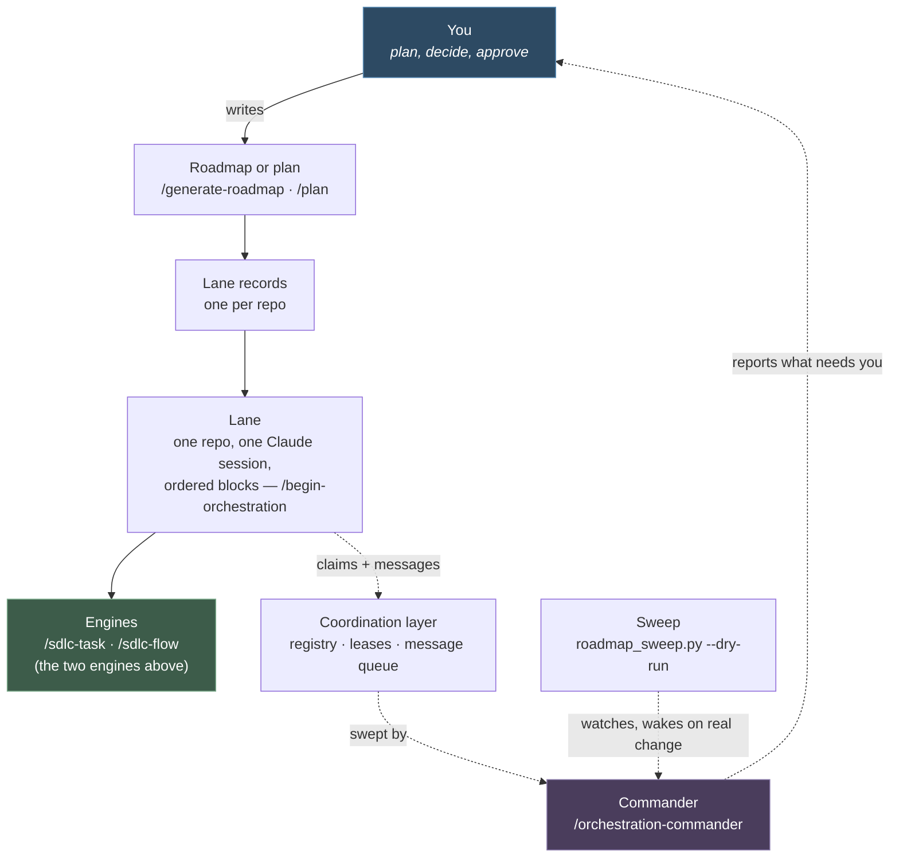

# base-template — an agentic SDLC harness

**A reusable "software factory": a set of Claude Code slash commands plus two JavaScript pipeline
engines that take a written spec through implement → test → review → document → commit, gated by
a project's own build/test commands.** Clone it, fill in a few tokens, and a new repo has a working
agentic development pipeline on day one.

> Part of a larger personal practice ("Bastion") this template was extracted from — that context
> isn't needed to use this repo standalone.

---

## What this is for

You hand an agent session a written **spec** (a small, scoped unit of work) and one command. The
agent implements it, runs your real test suite, reviews its own diff against the spec's acceptance
criteria, patches your docs, and commits — with every stage's evidence written to disk so a run can
be resumed or audited later. You do not have to remember to ask for tests or docs; the pipeline
enforces that structure.

This is **mechanism, not a product**: the `.claude/` harness ships zero stack assumptions (no npm
scripts, no port numbers, no framework). Every project supplies its own validation commands through
one config file, [`planning/harness.json`](#configuring-your-stack-planningharnessjson).

---

## Quickstart

Two things happen in two different places — a shell, and a Claude Code session. Each step below
says which.

| # | Step | Where |
|---|---|---|
| 1 | Clone or copy this repo somewhere; `cd` into your new project once it's generated (see step 2) | terminal |
| 2 | Generate a new project from this template | Claude Code — `/new-project` (run from the parent directory that manages your repos; see [prerequisites](#prerequisites)) |
| 3 | Fill in `planning/harness.json` with your real build/test/lint commands | terminal (edit the file) or Claude Code |
| 4 | Orient the agent and check what's runnable | Claude Code — `/prime`, then `/process-tasks` |
| 5 | Write a spec for one small piece of work | Claude Code — `/generate-tasks <name>` (or `/chore` / `/ticket` for ad-hoc work) |
| 6 | Run it | Claude Code — `/sdlc-task <name>` (small) or `/sdlc-flow <name>` (a whole spec, ends in a PR) |

Full walkthrough with all the intermediate detail: [`docs/using-the-template.md`](docs/using-the-template.md).

### Prerequisites

| Needed | Why | If missing |
|---|---|---|
| [Claude Code](https://claude.com/product/claude-code) CLI | Every command below (`/new-project`, `/prime`, `/sdlc-task`, …) is a Claude Code slash command | Install it first — nothing here runs without it |
| `git` | The pipeline commits per task/spec; `/new-project` can `git init` the new project | — |
| `node` (any modern LTS) | The two pipeline engines are plain JavaScript, invoked by Claude Code directly (not run as an npm package) | Install Node |
| `python3` | Some validation checks and this repo's own housekeeping scripts are Python (standard library only) | Install Python 3 |
| A manager repo above this one that already has `.claude/commands/` installed | `/new-project` scaffolds *into* a sibling directory, not into `base-template/` itself | See [`docs/using-the-template.md`](docs/using-the-template.md) step 1, or copy `.claude/` yourself and skip `/new-project` |

---

## Vocabulary, up front

A few words get used constantly below. One line each; the full table lives in
[`docs/workflows/index.md`](docs/workflows/index.md#vocabulary).

| Term | Plain English |
|---|---|
| **Harness** | The whole mechanism: commands + engines + schemas, in `.claude/` |
| **Spec** | The written instructions for one unit of work: `planning/blocks/<ID>.json` + `planning/<ID>/tasks.json` |
| **Block** | One unit of work with an ID, e.g. `ticket.fix-the-thing` |
| **Engine** | The automation that actually writes code for one spec — [`/sdlc-task`](#the-two-sdlc-engines) or [`/sdlc-flow`](#the-two-sdlc-engines) |
| **Gate** | A check that must pass (lint, tests, build) before a stage can report success |
| **Lane** | One repo, one Claude session, one ordered chain of blocks, driven by [`/orchestrate`](.claude/commands/orchestrate.md) |
| **Worktree** | A second checkout of a repo in its own folder, for isolation — pass `--worktree`; see [below](#worktree-isolation) |

---

## How a spec moves through the pipeline



In words:

1. **You write a spec** — one scoped unit of work, with observable acceptance criteria.
2. **You pick an engine and run it** — [`/sdlc-task`](docs/workflows/sdlc-task.md) for a small
   change, [`/sdlc-flow`](docs/workflows/sdlc-flow.md) for a whole feature spec.
3. **Implement → Test → Fix loops** until the project's own gated checks pass (or the retry budget
   runs out and the run reports `FAIL`).
4. **Review** issues a verdict by re-running the gates itself and checking the diff against the
   spec's acceptance criteria — a sloppy test report can't force a `PASS`.
5. **On `PASS`**, `/sdlc-flow` patches your docs and opens a pull request; `/sdlc-task` commits
   directly (no PR, no docs stage — it's the fast path).

---

## The two SDLC engines

Only two engines exist today. (Two earlier ones — `/sdlc-run` and `/sdlc-block` — were retired once
`/orchestrate` and `/sdlc-flow` covered their jobs; see this repo's own decision log,
`planning/decisions/D70-orchestrate-supersedes-sdlc-block.md`.)

| Engine | What it runs | Use it when… |
|---|---|---|
| [`/sdlc-task <spec>`](docs/workflows/sdlc-task.md) | implement → fast-test → fix (up to 3 attempts) → commit. No review or docs stage. | One small, tested change — a `/chore` or `/ticket`. |
| [`/sdlc-flow <spec>`](docs/workflows/sdlc-flow.md) | Every task in a spec, sequentially, on one branch; per-task test-fix loop; **one** consolidated end-review; a docs patch; terminates in a **pull request**. | Non-trivial feature work — this is the default for anything with several moving parts. |

Above these:

- [`/patch`](.claude/commands/patch.md) — a lighter hotfix ladder rung, below `/sdlc-task`: implement
  → validate → commit for a small, low-risk single-file fix, skipping the test/review ceremony
  entirely.
- [`/orchestrate <block-id ...>`](.claude/commands/orchestrate.md) — drives one repo's **lane**: an
  ordered chain of blocks, run strictly one at a time, choosing `/sdlc-task` or `/sdlc-flow` per
  block. Not a third engine — a driver that calls the two above. Multi-repo version:
  [`/begin-orchestration`](.claude/commands/begin-orchestration.md). Full lane lifecycle:
  [`docs/workflows/orchestration.md`](docs/workflows/orchestration.md); the coordination layer
  underneath concurrent lanes: [`docs/workflows/lane-coordination.md`](docs/workflows/lane-coordination.md).

Both engines write a **committed** JSON state file under `planning/<spec>/sdlc/` after every stage,
so a run is resumable (`--resume`) and auditable from disk rather than chat history.

### Worktree isolation

Both engines accept a `--worktree` flag for true isolation — a second checkout of the repo under
`trees/<branch>/`, so an in-flight run cannot collide with other work on the main tree. This was
suspended fleet-wide (brain decision `D81-worktree-moratorium`, 2026-08-23) after three separate
whole-repo-deletion incidents where a green pipeline run silently committed an empty tree; the
moratorium was lifted 2026-08-28 after an end-to-end verification run
(`BT.ticket.worktree-smoke-fixture`) confirmed the guards added during the suspension — the
worktree-setup binding guard, the commit-safety guard, and the post-commit work assertion — hold
under a real worktree run. Default is still the plain-branch, in-main-tree mode (cheaper, and a
worktree never protected a running chain from its own mid-chain engine edits — see
`docs/workflows/orchestration.md`); pass `--worktree` when a change genuinely needs quarantine.

---

## Orchestrating across lanes

Everything above runs **one spec, in one repo.** Real work is usually bigger than that: several
specs, sometimes several repos, that need to land in order without two agents editing the same file
at once. **Orchestration is the layer that drives many blocks — across one or many repos — without
you babysitting each engine run by hand.** This is the load-bearing part of this template today; the
two engines above are what it drives.

**Start here for the whole system:** [`docs/workflows/orchestration-runbook.md`](docs/workflows/orchestration-runbook.md)
— quickstart, running several lanes at once, monitoring a run, and troubleshooting. This section is
the two-minute version; the runbook is the real reference.



1. **You author the work** as a roadmap ([`/generate-roadmap`](.claude/commands/generate-roadmap.md),
   many repos) or a single-repo plan ([`/plan`](.claude/commands/plan.md)).
2. **Each repo gets a lane record** — an ordered list of blocks for that repo.
3. **You open one Claude Code session per repo** and type
   [`/begin-orchestration`](.claude/commands/begin-orchestration.md) (single repo:
   [`/orchestrate`](.claude/commands/orchestrate.md)) — that session becomes a **lane**, running its
   blocks one at a time, each through `/sdlc-task` or `/sdlc-flow`.
4. **Lanes never edit each other's repos.** They coordinate through a shared **coordination
   layer** — a registry of who's running, per-repo leases, and a message queue lanes leave each
   other notes in — never by talking directly.
5. **The commander drains that layer** and tells you what's piled up:
   [`/orchestration-commander`](.claude/commands/orchestration-commander.md) interactively, or
   [`scripts/commander_drain.sh`](scripts/commander_drain.sh) unattended (no dry-run — always
   writes).
6. **The sweep decides *when* a drain is worth running** — `agentic-portfolio/scripts/roadmap_sweep.py
   --dry-run`, watching for real change and waking a commander only then. Lives in the HQ repo, not
   here; runbook: [`docs/workflows/roadmap-sweep.md`](docs/workflows/roadmap-sweep.md).

**What you personally do:** write the roadmap or plan (1), open one session per lane and start it
(3), and answer whatever the commander or a lane's operator gate surfaces (5). The rest — block
sequencing, coordination, and deciding whether anything needs you — runs unattended.

One repo (lane) always runs its blocks **strictly sequentially, one engine at a time** — never a
second engine in the same repo before the first has integrated. Full lane lifecycle (the six
phases, artifacts, escalation records): [`docs/workflows/orchestration.md`](docs/workflows/orchestration.md).
The registry/lease/queue layer, cold-start setup, and troubleshooting:
[`docs/workflows/lane-coordination.md`](docs/workflows/lane-coordination.md).

---

## Repo layout

```
base-template/
├── .claude/
│   ├── commands/        ← the slash commands (flat — invoke any as /<name>)
│   └── workflows/        ← the two engines (sdlc-task.js, sdlc-flow.js) + JSON schemas
├── scaffold/              ← tokenized project template — copied into every new project
│   ├── CLAUDE.md  README.md  log.md
│   └── planning/          ← context.md, status.md, master-plan.md, harness.json stub, decisions/
├── docs/
│   ├── capabilities.md         ← everything you can run, one line each, and how to invoke it
│   ├── using-the-template.md   ← full generate → configure → run walkthrough
│   ├── architecture.md         ← the harness/scaffold split, OKF naming conventions
│   ├── harness-json.md         ← planning/harness.json config reference + stack profiles
│   ├── gates.md                ← the 52 checks this repo runs on itself
│   ├── ci.md                   ← hosted CI for public repos scaffolded from this template
│   └── workflows/              ← engine + orchestration reference (start at index.md)
├── planning/               ← this repo's own planning (see note below — not in the public clone)
├── .github/workflows/      ← reusable CI gates a generated repo can opt into (Rust, Python, Flutter, Node/docs)
├── CLAUDE.md               ← agent guide for working ON this template
└── log.md                  ← this template's own change history
```

| Path | What it is |
|---|---|
| [`.claude/commands/README.md`](.claude/commands/README.md) | The full command catalog — every phase, every flag |
| [`.claude/workflows/`](.claude/workflows/) | `sdlc-task.js`, `sdlc-flow.js`, and the JSON schemas they/other tooling validate against |
| [`scaffold/`](scaffold/) | What a new project actually gets (see [below](#what-a-new-project-gets)) |
| [`docs/capabilities.md`](docs/capabilities.md) | The capability catalogue — every command, engine, skill, script and gate, with how to run it |
| [`docs/index.md`](docs/index.md) | Navigation for everything under `docs/` |
| [`docs/workflows/index.md`](docs/workflows/index.md) | The engine/orchestration reference hub — vocabulary table, diagrams, token usage |
| `planning/harness.json` | This repo's own pipeline config (dogfooded — parses its own two engines) |
| `planning/decisions/` | This template's append-only architecture decision log |

**A note on `planning/`:** in the author's working copy this is a symlink into a private, external
vault (so it's gitignored and carries no history in this public repo) — the same arrangement every
generated project inherits (see [Tokens](#tokens-substituted-at-generation-time) below). Cloning
this repo gets you everything above `planning/`; the decision log and this repo's own status
tracking live outside the public clone. That symlink arrangement is not required for a project you
generate from this template — a `planning/` populated from `scaffold/planning/` works as a normal
directory too.

---

## What a new project gets

[`/new-project`](.claude/commands/README.md) (run from the managing parent directory, not from
inside `base-template/`) does the following:

1. Copies `.claude/workflows/` (the two engine `.js` files + schemas) into the new project.
   Commands are **not** copied by default — a generated project picks up the global command set
   from `~/.claude/commands/` instead (installed once via
   [`/sync-global-commands`](.claude/commands/sync-global-commands.md)). Pass `--include-commands`
   for a fully self-contained, offline/shareable copy.
2. Copies the **contents** of [`scaffold/`](scaffold/) into the new project root and substitutes
   the tokens below.
3. Stamps the generating commit hash as provenance.
4. Optionally `git init`s the new directory.

After generation the project has a complete `planning/` skeleton and the full harness, but **no
application code and no configured validation commands yet** — that's step 3 of the
[Quickstart](#quickstart).

### Tokens substituted at generation time

| Token | Replaced with |
|---|---|
| `{{PROJECT_NAME}}` | Human-readable project name |
| `{{SLUG}}` | kebab-case directory/identifier slug |
| `{{DESCRIPTION}}` | One-sentence description |
| `{{PROJECT_TYPE}}` | `personal` · `client` · `infrastructure` |
| `{{DATE}}` | Generation date (`YYYY-MM-DD`) |
| `{{TEMPLATE_COMMIT}}` | The `base-template` commit hash the project was generated from |
| `{{VERIFIED_HANDLES}}` | The project's authoritative identities/handles/URLs, or `none` |

Full generate → configure → first-run walkthrough, including the `harness.json` stack profiles and
the resync loop for pulling later harness improvements into an already-generated project:
[`docs/using-the-template.md`](docs/using-the-template.md).

---

## Configuring your stack: `planning/harness.json`

The harness carries **no** stack defaults — every project's real build/lint/test commands live in
one file the engines read at Test and Review time.

- Reference + all schema fields: [`docs/harness-json.md`](docs/harness-json.md)
- Ready-made profiles to copy from (Rust / Python / Next.js): `scaffold/planning/harness.examples.md`
  (ships inside every generated project; view it in this repo at
  [`scaffold/planning/harness.examples.md`](scaffold/planning/harness.examples.md))
- If the file is absent, the Test/Review stages fall back to the spec's own `## Validation
  Commands` markdown section and the UI-test stage is disabled — usable for a quick start, less
  reliable than a real config.

## Hosted CI for public repos

A repo generated from this template can opt into GitHub-hosted CI that mirrors its
`planning/harness.json` gates on every push/PR, via one of four reusable workflows this repo owns
(Rust, Python/uv, Flutter, Node/docs). Setup, the `actionlint` → `act` → push validation loop, and
per-repo deviations: [`docs/ci.md`](docs/ci.md).

---

## Troubleshooting

| Symptom | Likely cause | Check |
|---|---|---|
| `/test` / `/review-task` silently uses a different command than you expected | `planning/harness.json` is missing or a check's `command` field doesn't match what you run locally | [`docs/harness-json.md`](docs/harness-json.md) § Full schema |
| A generated project's `harness.json` `$schema` reference doesn't resolve in your editor | `planning/` in a generated project is a symlink into an external vault, and the schema path resolves differently depending on whether the reader follows the symlink | [`docs/harness-json.md`](docs/harness-json.md) § Why the `$schema` path resolves from two different physical parents |
| A pipeline run stops mid-spec and you're not sure where it left off | Every engine stage writes committed state | Re-run with `--resume`; inspect `planning/<spec>/sdlc/state.json` and `worklog.md` directly |
| You want to pull a later harness improvement into a project you already generated | Generated projects don't auto-sync | [`docs/using-the-template.md`](docs/using-the-template.md) § 6, or run [`/sync-downstream-harness`](.claude/commands/sync-downstream-harness.md) from this repo's root |

---

## See also

- [`docs/using-the-template.md`](docs/using-the-template.md) — full generate → configure → first-run guide
- [`docs/architecture.md`](docs/architecture.md) — the harness/scaffold split and OKF naming conventions
- [`docs/workflows/index.md`](docs/workflows/index.md) — engine reference hub: vocabulary, diagrams, token-usage figures
- [`docs/workflows/orchestration-runbook.md`](docs/workflows/orchestration-runbook.md) — **start here for the whole orchestration system**: quickstart, running several lanes, monitoring, troubleshooting
- [`docs/workflows/orchestration.md`](docs/workflows/orchestration.md) · [`docs/workflows/lane-coordination.md`](docs/workflows/lane-coordination.md) · [`docs/workflows/roadmap-sweep.md`](docs/workflows/roadmap-sweep.md) — one lane's lifecycle, the coordination layer underneath several, and the mid-run monitoring sweep
- [`.claude/commands/README.md`](.claude/commands/README.md) — every command, every flag
- `planning/decisions/index.md` — this template's ADR log (see the `planning/` note above)
- [`.claude/skills/write-repo-doc/SKILL.md`](.claude/skills/write-repo-doc/SKILL.md) — the standard this file follows

## License

Licensed under either of

- Apache License, Version 2.0 ([LICENSE-APACHE](./LICENSE-APACHE) · <http://www.apache.org/licenses/LICENSE-2.0>)
- MIT license ([LICENSE-MIT](./LICENSE-MIT) · <http://opensource.org/licenses/MIT>)

at your option. Unless you explicitly state otherwise, any contribution intentionally submitted for
inclusion in this work by you, as defined in the Apache-2.0 license, shall be dual licensed as
above, without any additional terms or conditions.

Built for one operator and released because it may be useful to others — there is no support
obligation, no issue-response SLA, and no stability promise.
