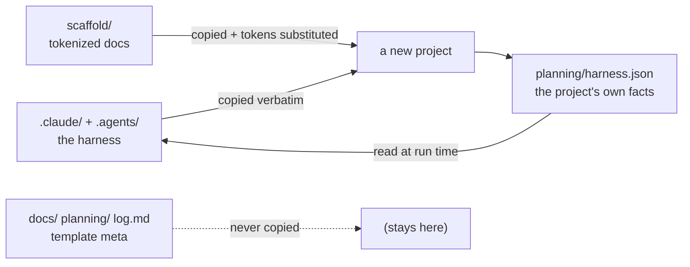

# base-template architecture

Why the template is shaped the way it is — and which half of it your change belongs in.

## What this page is for

Every design rule in this repo comes from one idea: **the harness ships mechanism, the project
supplies the facts.** If you understand where that line runs, you know where any new file goes,
why a stack default in an engine is a bug, and why renaming `status.md` is a lockstep change
rather than a tidy-up.

Read this before changing anything in `.claude/` or `scaffold/`. To *use* the template instead of
modify it, go to [using-the-template.md](using-the-template.md).

## Quickstart

See the split for yourself, in a **terminal** at the repo root:

```
ls .claude/ .agents/        # the harness  — copied verbatim into every project
ls scaffold/                # the scaffold — copied and token-substituted
ls docs/ planning/ log.md   # template meta — never copied anywhere
```

The rule that follows from those three lines: **a project fact in `.claude/` is a bug**, and a
hardcoded project name in `scaffold/` is a bug. Everything below explains why.

## The shape



In sentences:

1. `.claude/` and `.agents/` are copied into the new project **byte for byte** — same pipeline
   everywhere, which is why documenting the engines anywhere but here would drift.
2. `scaffold/`'s contents are copied to the project root with every `{{TOKEN}}` substituted.
3. The template's own `docs/`, `planning/`, `log.md`, `CLAUDE.md` and `README.md` are **never**
   copied — they are the factory's records, not a new project's.
4. The project writes its own facts into `planning/harness.json`, and the harness reads them at
   run time. That file is the entire seam between mechanism and policy.

**The step you personally do is 4.** The other three happen inside `/new-project`.

## The two halves

Every new project gets exactly two things from this template, copied verbatim:

| Half | Source path | Destination in new project | What it is |
|---|---|---|---|
| **Harness** | `.claude/` | `.claude/` | The SDLC pipeline — commands + workflow engines. Ships *mechanism only*, never project facts. |
| **Scaffold** | `scaffold/` (contents) | project root | Tokenized project docs: `CLAUDE.md`, `README.md`, `log.md`, and a full `planning/` skeleton. |

The template's own `log.md`, `planning/`, `docs/`, `CLAUDE.md`, and `README.md` are **never
copied**. They are the factory's own records and must not pollute a new project's clean start.

## Harness: mechanism only

The `.claude/` tree ships mechanism — the *how* of running a pipeline — and reads all
project-specific *policy* from `planning/harness.json`. This means:

- The engines (`workflows/*.js`) carry zero stack defaults. No npm scripts, no port numbers,
  no framework assumptions.
- Every validation command, route, and UI-test config lives in the project's
  `planning/harness.json`, not in the engine code.
- Universal rules (no emoji in docs, parallel port = `port + taskNumber`) stay hardcoded in
  the engine because they apply to every project, making them mechanism, not policy. The emoji
  gate is diff-scoped: it judges only lines added in the run's diff, never a whole changed file,
  so pre-existing emoji in a legacy file never fails a change that didn't touch those lines.

See [harness-json.md](harness-json.md) for the config format and all three stack profiles.

## Scaffold: tokenized project docs

The `scaffold/` directory is a complete starting-state for a new project's documentation:

```
scaffold/
  CLAUDE.md                   ← project-specific agent guide (tokenized)
  README.md                   ← project README (tokenized)
  log.md                      ← project change history (clean start)
  planning/
    context.md                ← orientation doc
    status.md                 ← current focus tracker
    master-plan.md            ← phase/block tracker
    index.md                  ← planning/ navigation
    harness.json              ← neutral stub — fill in for your stack
    harness.examples.md       ← Rust / Python / Next.js profiles to copy from
    decisions/
      D1-initial-okf.md       ← the project's first ADR (bootstrap)
      index.md                ← decisions navigation
```

`/new-project` substitutes tokens (`{{PROJECT_NAME}}`, `{{SLUG}}`, etc.) across all scaffold
files at generation time. See `README.md` for the full token table.

## OKF naming conventions

These names are **load-bearing** — the SDLC engines read them directly. Any rename must move
in lockstep with the workflow code in `.claude/workflows/`.

| Convention | Rule |
|---|---|
| **Lowercase docs** | `status.md`, `master-plan.md`, `context.md`, `log.md`, `index.md` — no uppercase names |
| **Concept-folder model** | Spec work lives at `planning/<concept>/tasks.md`; pipeline machine-state at `planning/<concept>/sdlc/` (run-state JSON, `reports/`) |
| **`index.md` for directories** | Every directory that needs a listing file uses `index.md`, not `README.md` |
| **`sdlc/` reserved** | `planning/<concept>/sdlc/` is exclusively for pipeline-generated state — never author files there manually |

## The mechanism/policy split (harness.json)

Before OKF Phase 2, the engines hardcoded the learn-ai stack (npm scripts, port 3003, pt-BR
parity, etc.). The split introduced `planning/harness.json` as the clean seam:

```
MECHANISM (harness, copied as-is)         POLICY (project, via harness.json)
─────────────────────────────────         ──────────────────────────────────
pipeline ordering                         validation command list
retry loops                               whether a UI-test stage exists
report formats                            dev server command + ready signal
"run the validation suite"                port number and smoke routes
"run the UI smoke check"                  stack label (informational)
emoji gate (universal, diff-scoped — added lines only)
port = port + taskNumber (universal)
```

Config absent → validation falls back to the spec's `## Validation Commands` section;
UI-test stage is disabled. See [harness-json.md](harness-json.md) for the full schema.

## The update loop

When a downstream project reveals something that improves the factory:

1. Make the change **here**, in `base-template`.
2. If it is a keep/drop or behavioral call, add an atomic ADR under `planning/decisions/`.
3. Append a dated entry to `log.md`.
4. Commit. The new commit hash becomes the provenance stamp for the next generated project.

Downstream projects do **not** auto-sync. They pull improvements manually and diverge by
design — this is intentional. Track the propagation effort in the company brain.
