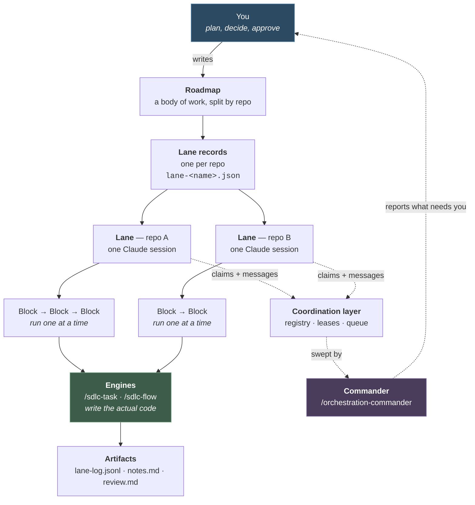
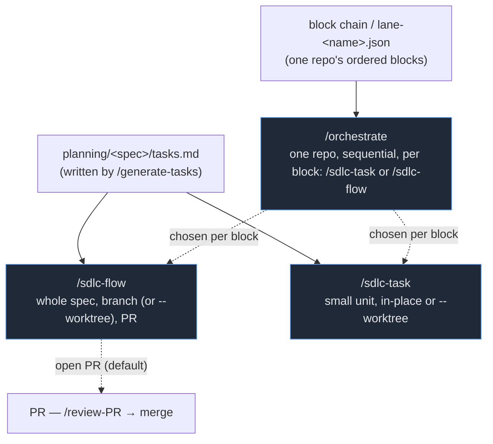

# SDLC Workflows

> **Start here.** Want the whole picture — quickstart, running several lanes, monitoring a run,
> troubleshooting the whole system? Read [orchestration-runbook.md](orchestration-runbook.md).
> Driving one lane? Read [orchestration.md](orchestration.md). Setting up or troubleshooting the
> registry/leases/queue/commander underneath it? Read [lane-coordination.md](lane-coordination.md).

This is the canonical reference for the **harness's automated pipelines** — the `.claude/workflows/*.js`
engines that drive a spec from a `tasks.md` to merged, tested, documented code.

> **This lives here on purpose.** These engines are authored and evolved in `base-template` (the
> software-factory source). Downstream projects copy `.claude/` verbatim, so the workflows are
> identical everywhere — documenting them anywhere else would drift. When an engine changes, update the
> matching page here in the same change.

---

## Quickstart

Pick the smallest rung that fits the work. All **Claude Code slash commands**:

| The work | Type this |
|---|---|
| A hotfix or docs-only change | `/patch <description>` |
| One small unit of behaviour change | `/sdlc-task <spec-slug>` |
| A real feature, many moving parts | `/sdlc-flow <spec-slug>` |
| An ordered chain of blocks | `/orchestrate <block-id ...>` |
| One lane of a multi-repo roadmap | `/begin-orchestration --roadmap <path> --lane <name>` |

Each needs a spec on disk first — `/ticket`, `/chore` or `/plan`, then `/generate-tasks`. The
ladder and its rationale is [The pipeline ladder](#the-pipeline-ladder); every command in the
repo is catalogued in [`../capabilities.md`](../capabilities.md).

Unfamiliar with **spec**, **block**, **lane** or **engine**? [Vocabulary](#vocabulary) defines
each one, and every page here links back to it.

## The system in one picture

If you have never run any of this, read this section and nothing else. It is the whole model.



**In words:**

1. **You write a roadmap** — the work, split up by which repo it lands in. Made with
   [`/generate-roadmap`](../../.claude/commands/generate-roadmap.md).
2. **Each repo gets a lane record** — a small JSON file listing that repo's blocks, in order.
   Shape: [`lane.schema.json`](../../.claude/workflows/lane.schema.json).
3. **You open one lane per repo**, each in its own Claude Code session, with
   [`/begin-orchestration`](../../.claude/commands/begin-orchestration.md). They run at the same time.
4. **Inside a lane, blocks run one at a time.** Each block hands off to an engine —
   [`/sdlc-task`](sdlc-task.md) or [`/sdlc-flow`](sdlc-flow.md) — and the engine writes the code.
5. **Lanes never share a working directory.** They coordinate through
   [the layer underneath](lane-coordination.md) — claiming identity, locking repos, and leaving each
   other messages.
6. **[The commander](../../.claude/commands/orchestration-commander.md) sweeps that layer** and tells you what needs a
   human. Run it by typing `/orchestration-commander`.

The only steps you personally do are 1, 3, and answering whatever the commander surfaces.

---

## Vocabulary

Terms used everywhere in these docs. Skim once; come back when a word stops making sense.

| Term | Plain English |
|---|---|
| **Brain root** | The top-level `agentic-portfolio/` directory — the one containing `brain.toml`. Almost every path in these docs is relative to it. |
| **Corpus** | Every markdown document across every repo, treated as one searchable body. What `validate-brain` checks. |
| **Repo** | One project with its own git — `learn-ai`, `mev`, `bastion`. There are ~18. |
| **Roadmap** | A plan spanning several repos, at `planning/roadmaps/<slug>/roadmap.md`. Created by [`/generate-roadmap`](../../.claude/commands/generate-roadmap.md). |
| **Block** | One unit of work with an ID like `LA.ticket.fix-the-thing`. The thing an engine actually builds. |
| **Lane** | One repo + one Claude session + one ordered list of blocks from one roadmap. Full lifecycle: [orchestration.md](orchestration.md). |
| **Lane record** | The JSON file naming a lane's blocks: `<roadmap-dir>/lane-<name>.json` ([schema](../../.claude/workflows/lane.schema.json)). |
| **Chain** | The ordered blocks a lane will work through. |
| **Engine** | The automation that writes code for one block — [`/sdlc-task`](sdlc-task.md) (small) or [`/sdlc-flow`](sdlc-flow.md) (a whole spec). |
| **Spec** | The instructions for one block: `planning/blocks/<ID>.json` + `planning/<ID>/tasks.json`. Written by [`/generate-tasks`](../../.claude/commands/generate-tasks.md); see D65 (`planning/decisions/D65-block-record-is-the-planning-unit.md`). |
| **Gate** | A check that must pass — tests, lint, build, `validate-brain`. A "red gate" is a failing one. |
| **Worktree** | A second checkout of the same repo in a separate folder, so two pieces of work don't collide. |
| **Lease** | A claim that says "this lane is using this repo right now, keep out." ([schema](../../.claude/workflows/lease.schema.json), [guide](lane-coordination.md)) |
| **Queue / drain** | Lanes leave each other messages in a queue. A *drain* is one pass that reads and routes them. ([schema](../../.claude/workflows/message.schema.json), [guide](lane-coordination.md)) |
| **Commander** | The thing that performs a drain and reports the leftovers. Run it as [`/orchestration-commander`](../../.claude/commands/orchestration-commander.md). |
| **Sweep** | The scripted check that decides *whether* a drain is worth running — snapshots a roadmap, diffs against the last snapshot, and wakes a commander only on real change. `agentic-portfolio/scripts/roadmap_sweep.py` (HQ repo); runbook: [`roadmap-sweep.md`](roadmap-sweep.md), setup: [lane-coordination.md §5](lane-coordination.md#5-running-the-commander). |
| **Escalation record** | One JSON line a lane appends to `planning/roadmaps/<roadmap>/escalations.jsonl` for anything it must not decide alone — dual-written alongside the prose entry in `notes.md`. Six `kind` values, a declared `channel`, a `verified_at_sha`. Detail: [orchestration.md § Escalation records](orchestration.md#escalation-records). |
| **Channel** | How an escalation reaches the operator, declared by the lane when it writes the record and never changed downstream: `notification` (a reducible decision that fits buttons) or `session:<slug>` (anything irreducible). See [orchestration.md § Escalation records](orchestration.md#escalation-records). |
| **Operator gate** | A point where the work stops because only a human can decide or do the next thing. That human is you. |
| **Carryover** | A recorded loose end — a bug found in passing, a deferred fix — kept in `state.json` so it is not lost. See the `edit-state-json` skill. |
| **`state.json`** | Per repo. The real record of what work exists and what state it is in. If it is not here, it does not exist. Editing it: the `edit-state-json` skill. |

---

## The pipeline ladder

```
/patch          trivial hotfix · no tests · in-place
/sdlc-task      small tested change · implement→test→fix→commit · in-place or --worktree
/sdlc-flow      full spec · sequential · branch (or --worktree) · terminates in PR   ← default for non-trivial work
/orchestrate    one repo's lane · ordered block chain · sequential, one engine at a time
```

## The two engines at a glance

| Engine | Scope | Isolation | Pairs with | You reach for it when… |
|---|---|---|---|---|
| [`/sdlc-task`](sdlc-task.md) | **one small unit** | in-place / `--worktree` | `/chore`, `/ticket` | small tested change — fast implement→test→commit |
| [`/sdlc-flow`](sdlc-flow.md) | **a whole spec**, **sequential** | plain branch in the main tree (one shared for the whole spec), or `--worktree` | `/generate-tasks` | **the default for non-trivial feature work** — sequential, conflict-free, terminates in a PR |

A whole roadmap is driven **one repo (one lane) at a time** by `/orchestrate` / `/begin-orchestration`,
which take an ordered chain of block IDs or a `lane-<name>.json` record — not a master-plan file —
and run each block sequentially through **`/sdlc-task` or `/sdlc-flow`, chosen per block**, one
engine run at a time, never a second engine in the same repo before the first has integrated.
Several repos can each run their own lane concurrently as separate sessions; within one repo it is
never parallel. See [orchestration.md](orchestration.md) for the lane lifecycle and
[`.claude/commands/README.md`](../../.claude/commands/README.md) for the flag-level reference.

The one-off stage commands (`/implement`, `/test`, `/fix`, `/review-task`, `/document`) were
**retired** — the engines are the only supported way to drive a spec. See
[prompt-parity.md](prompt-parity.md) for why, and what to run instead.



- `/sdlc-flow` is the **default for non-trivial feature work**: one shared branch eliminates
  inter-task merge conflicts; a single end-review over the integrated tree replaces per-task reviews;
  the terminal step is a PR. Runs on a plain branch in the main tree by default (keeps a relative
  `planning/` symlink intact), or in an isolated worktree with `--worktree`.
- `/orchestrate` is the **lane driver**: one repo, one session, an ordered chain of blocks run
  strictly sequentially — one engine run at a time, choosing `/sdlc-task` or `/sdlc-flow` per
  block, never a second engine in the same repo before the first has integrated. Several repos run
  their own lanes concurrently as separate sessions; see [orchestration.md](orchestration.md).
- `/sdlc-task` is the **fast path** for small work: a real implement→test→fix loop but no
  review/document/wrap-up agents. Pairs with `/chore` and `/ticket`.

### Decomposition is governed by compilable task boundaries, not disjoint files

`/generate-tasks` decomposes a block **before** the consuming engine is chosen. Every engine
`/orchestrate` drives — `/sdlc-task` and `/sdlc-flow` alike — runs its tasks **sequentially, on one
branch/worktree, with no inter-task merge step**, and gates the project's checks after **every
single task** — so **every task boundary must leave the gating suite passing** (for a
compiled/type-checked stack, the repo must compile at every boundary). A change that cannot be
split without an intermediate non-compiling task — e.g. a renamed public type and every call site —
lands in **one** task instead, even if that means merging tasks that would otherwise be file-disjoint.
That compilable-boundary rule is what actually governs decomposition today, and it does **not**
require the files a task names to be disjoint from another task's — two tasks are free to touch the
same file under these sequential engines, since there is no inter-task merge to collide.

An older version of this section additionally required blocks driven by `/orchestrate` to own
**disjoint files**, justified by a claim that each block ran as its own pipeline in isolated
worktrees merging independently of one another. That premise is false — `/orchestrate` runs one
repo sequentially, one engine at a time, with no concurrent per-block isolation to merge back (see
[orchestration.md](orchestration.md)) — so the requirement's stated justification did not survive
contact with the command, and it never had a second one. Ruled obsolete and deleted rather than
re-justified: `planning/decisions/D85-authoring-contract-rulings.md` ruling (a). Closes `state.json`
carryover `disjoint-files-rule-needs-a-true-justification`.

The full rule, its precedence, and the escape hatches (`additiveFiles`, `dependsOn`) live in
[`generate-tasks.md`](../../.claude/commands/generate-tasks.md) — see its step 6 — rather than being
restated here.

---

## Shared concepts (true for all engines)

### Each stage is its own agent
Every pipeline stage runs as a **separate single-context agent**. Stages never share memory — they
communicate through committed files under `planning/<spec>/sdlc/`. That is what makes the pipeline
crash-recoverable and resumable: the committed files *are* the state.

### Committed state model

Each engine writes a committed JSON state file under `planning/<spec>/sdlc/`:

| Engine | State file | Status |
|---|---|---|
| `/sdlc-task` | `sdlc-task-state.json` | committed — per-task status + token roll-up (D38) |
| `/sdlc-flow` | `sdlc-flow-state.json` | committed — authoritative run index; drives `--resume` (D31) |

`/sdlc-flow` also writes a human-readable `worklog.md` alongside its state file. The other engines
use per-stage report files (see below) as the primary resume signal; their state files are the
at-a-glance index and token accounting artifact.

### State + worklog contract (Phase 2-5 commands invoked by hand)
There is no per-stage prose report file. `/implement`, `/test`, `/fix`, `/review-task`, and
`/document`, invoked by hand, each read and update one shared `planning/<spec>/sdlc/state.json`
(per-task keyed: status, attempts, files changed, commit, validation result) and append a section to
`planning/<spec>/sdlc/worklog.md` — the same D31 shape `/sdlc-flow` uses, adapted for a standalone
run (`mode: "standalone"`). Both files are write-only: never `git add`/`git commit`ed, read back off
disk rather than git history.

| Artifact | Written by | Read by |
|---|---|---|
| `sdlc/state.json` (`tasks["<N>"]` entries) | implement, test, fix, review-task, document — each command only touches the fields/tasks it owns | every later stage on the same spec; `/fix` gates on `review.verdict` |
| `sdlc/worklog.md` (`## Task <N> — <STAGE>` sections; `/fix` appends a `FIX PASS <k>` section per pass rather than overwriting) | implement, test, fix, review-task, document | human-readable run trail for the next stage or a resuming operator |
| `sdlc-flow-state.json` | `/sdlc-flow` state-writer (D31 (`planning/decisions/D31-committed-authoritative-state.md`)) | `--resume`, end-review localization, PR body — **committed** |
| `worklog.md` (flow-scoped) | `/sdlc-flow` state-writer (D31 (`planning/decisions/D31-committed-authoritative-state.md`)) | human-readable run trail — **committed** |

### The two hard gates
1. **Review gates Document** — `/document` refuses to run unless the review verdict is `PASS`.
2. **Fresh tests gate the PASS verdict** — review re-runs the *gating* validation checks itself; a
   failing check forces `FAIL`/`PARTIAL` no matter how clean the code reading was. A sloppy test report
   can never ship a bug.

### `/close-out`'s diff base is resolved, never hard-coded

`/close-out` — the manual quality-close command every engine points to on completion (`sdlc-flow.js`:
"Next: run `/close-out` to verify coverage + patch docs before handing off") — scopes
its universal emoji gate and its source-file coverage sweep to the **same resolved base**, never the
literal string `main`. A hard-coded `main..HEAD` is empty by definition whenever `HEAD` **is** `main`
— the default state after an in-place `/sdlc-task` run, a plain-branch `/sdlc-flow` run (D51), or
right after `--auto-merge`/`--merge-branch` land — which used to report a vacuous "OK" over zero
files instead of "nothing considered."

`/close-out` now resolves the base once, before Step 1, from real evidence: an explicit `--base
<ref>`, else `planning/harness.json`'s `flow.prBase`, else `origin/HEAD`, else a local `main` or
`master`. If the current branch **is** the resolved base, it falls back to the enclosing merge
commit's first parent (`HEAD^1..HEAD`) when one exists (e.g. right after `--auto-merge`); with no
merge commit to scope from, it **refuses to run** rather than proceed with an empty file list. This
mirrors the pattern the engines already use for their own diff scoping — `sdlc-task.js`'s committed
`baseSha`, `sdlc-flow.js`'s configured `${prBase}` —
`/close-out` is the one caller-facing command that previously had none of that context available to
it. Full flag reference: the `/close-out` entry in [`.claude/commands/README.md`](../../.claude/commands/README.md).

### Validation is policy, not mechanism
No engine ships stack defaults. Each project declares its validation commands (and optional UI-test
stage) in [`planning/harness.json`](../harness-json.md). The test/review stages run exactly those
checks; absent a config they fall back to the spec's `## Validation Commands` block and disable the
UI-test stage. **Universal** rules stay hardcoded (no emoji in changed markdown, every change ships with
tests, parallel port = `port + taskNumber`).

### Model tiering — match the model to the work
> **Opus plans · Sonnet judges · Haiku does the mechanics.**

Each stage names its model in a `MODEL` map at the top of its engine. Without the map, every stage would
inherit the *session* model (launch from Opus → scout/test run on Opus too). A sharp spec + breakdown
makes implement/test/review well-scoped enough that Sonnet is reliable, so only spec authoring needs
Opus and the purely-procedural stages drop to Haiku.

| Tier | Stages | Why |
|---|---|---|
| **Opus** | `generate-tasks` (fallback), `enumerate-blocks` | planning / dependency-graph derivation — the leverage point |
| **Sonnet** | `implement`, `fix`, `triage`, `review`, `ui-test`, `document`, `wrap-up`, `pre-flight`, `PR` | judgment work |
| **Haiku** | `scout`, `setup`, `test`, `update-task`, `state-writers` | fixed procedures, no judgment |

**Staged escalation:** inside `/sdlc-task` and `/sdlc-flow`, the *final* fix pass and
*final* review attempt run on `ESCALATION_MODEL` (`opus`). A hard task that has already failed gets one
strong shot before the pipeline wraps up `FAIL`. Set `ESCALATION_MODEL = null` to disable.

The real planning leverage is **upstream**: `/generate-tasks` and `/breakdown` run on your *session*
model, so author specs on an Opus session, then let the pipeline grind on Sonnet.

### The retry loop (max 3 attempts)
`implement → test → review →` `PASS: document` **or** `FAIL/PARTIAL: fix → test → review`.
`/sdlc-flow` and `/sdlc-task` use a triage-gated bail instead of a
simple counter: triage classifies each failure as `RETRYABLE` or stuck, and stops early on stuck. Each
fix pass is its own commit, so the diff from each pass is auditable. After max failures the pipeline
wraps up `FAIL`.

---

## Token usage

Costs are dominated by stage count × model tier × spec size. Per-run token totals are recorded in
each engine's committed state file — check the state JSON for real figures from past runs.

| Workflow | Typical agents per run | Notes |
|---|---|---|
| `/sdlc-task` (one task, PASS first try) | ~4–6 | scout + implement + test + commit |
| `/sdlc-flow` (5-task spec, PASS first try) | ~30–40 | setup + per-task update/implement/test + end-review + docs + wrap-up + PR |
| `/orchestrate` (5-block lane) | N × (`/sdlc-task` or `/sdlc-flow`) + orchestration | dominated by child engine costs |

> **Token roll-up note:** all engines record **substantive-stages-only** totals — cheap Haiku helper
> agents (state writers, enumerate, update-task) are excluded. See
> D37 (`planning/decisions/D37-unified-committed-state-and-telemetry.md`).

---

## Pages

- **[orchestration-runbook.md](orchestration-runbook.md)** — the umbrella guide to the whole
  orchestration system: what it is, starting one lane or several, monitoring a run, when the
  commander and the sweep get involved, attaching to a commander's tmux session, and
  whole-system troubleshooting. Links down into the three pages below rather than restating them.
- **[sdlc-flow.md](sdlc-flow.md)** — the default for non-trivial feature work (D30). Shared worktree,
  per-task test-fix loop, triage-gated bail (D32), committed state model (D31), PR wrap-up (D33).
- **[sdlc-task.md](sdlc-task.md)** — lean single-unit engine (D38). In-place or `--worktree`, implement→test→fix→commit, pairs with `/chore`/`/ticket`.
- **[prompt-parity.md](prompt-parity.md)** — where the two engines' stage prompts and the matching
  one-off commands agree, where they deliberately differ, and the open drift register between them.
- **[sdlc-state-vocabulary.md](sdlc-state-vocabulary.md)** — the closed, gated enum of `status`
  values `sdlc-task-state.json` / `sdlc-flow-state.json` may carry, and the terminal-status →
  `state.json` block-status mapping table.
- **[orchestration.md](orchestration.md)** — the lane lifecycle: what a lane is, the phases from
  `/begin-orchestration` through the terminal `review.md`, the mandatory artifacts (including the
  escalation record), and the traps.
- **[lane-coordination.md](lane-coordination.md)** — the operator's guide to the layer underneath
  a lane: the registry, leases, message queue, ping contract, commander, and the sweep that decides
  when a drain is worth running — setup, a cold-start walkthrough, and troubleshooting.
- **[roadmap-sweep.md](roadmap-sweep.md)** — runbook for `agentic-portfolio/scripts/roadmap_sweep.py`,
  the scripted liaison sweep: flags, the snapshot/diff/route pipeline, `--dry-run`, and escalation
  routing.
- **[worktrees-in-rust-repos.md](worktrees-in-rust-repos.md)** — why a `path = "../<crate>"` Cargo
  dependency cannot resolve from inside a worktree, and the `trees/` sibling-symlink convention
  that fixes it.

> A whole roadmap is driven **one repo (lane) at a time** by `/orchestrate` / `/begin-orchestration`
> — an ordered block chain, sequential, one engine (`/sdlc-task` or `/sdlc-flow`, chosen per block)
> at a time, `/review-PR` on any PR a block produces — see [orchestration.md](orchestration.md) and
> [`.claude/commands/README.md`](../../.claude/commands/README.md); block-level roadmap orchestration
> no longer has a dedicated engine of its own (D39 superseded).

## Related

- [harness-json.md](../harness-json.md) — the `planning/harness.json` config the engines read.
- [`.claude/commands/README.md`](../../.claude/commands/README.md) — the command catalog.
- `planning/decisions/` (`planning/decisions/index.md`) — the ADRs behind each behavior (D6–D43).
