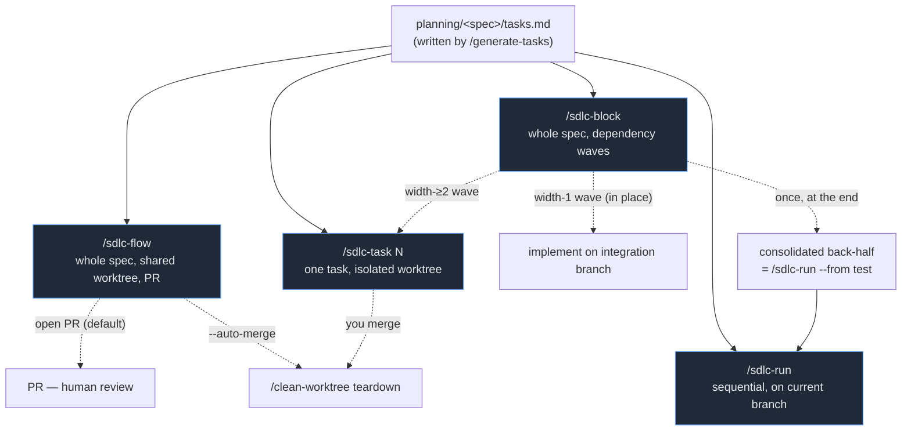

# SDLC Workflows

This is the canonical reference for the **harness's automated pipelines** — the `.claude/workflows/*.js`
engines that drive a spec from a `tasks.md` to merged, tested, documented code, and the manual
slash-command lifecycle they automate.

> **This lives here on purpose.** These engines are authored and evolved in `base-template` (the
> software-factory source). Downstream projects copy `.claude/` verbatim, so the workflows are
> identical everywhere — documenting them anywhere else would drift. When an engine changes, update the
> matching page here in the same change.

---

## The four engines at a glance

| Engine | Scope | Isolation | Merges for you? | You reach for it when… |
|---|---|---|---|---|
| [`/sdlc-flow`](sdlc-flow.md) | a **whole spec**, **sequential** | its own git worktree (one shared for the whole spec) | opt-in via `--auto-merge`; default stops at an open PR | **the default for non-trivial feature work** — sequential, conflict-free, terminates in a PR |
| [`/sdlc-run`](sdlc-run.md) | one task **or** a full spec, **sequential** | none — runs on the current branch | n/a (no branches) | running one spec/task start-to-finish on the current branch; resuming an interrupted pipeline |
| [`/sdlc-task`](sdlc-task.md) | **one** task | its own git worktree | no — you run `/clean-worktree` | running tasks in parallel across sessions, or keeping `main` clean for risky work |
| [`/sdlc-block`](sdlc-block.md) | a **whole spec** as dependency-ordered waves | shared integration branch; worktrees only for genuinely parallel waves | **yes** — merges every wave + runs one consolidated back-half | the rare speed case — task-level parallelism for genuinely independent tasks |

> **`/sdlc-block` repositioning (documented follow-on):** `/sdlc-block` is slated to become a
> block-level orchestrator that drives independent blocks or phases in parallel, each block run by
> `/sdlc-flow` in its own worktree. The current task-level wave behavior becomes the rare speed-only
> mode. This is near-trivial once `/sdlc-flow` exists; see
> [D30](../../planning/decisions/D30-sdlc-flow-engine.md) for the rationale.

For step-by-step **manual** control (run `/implement`, then inspect, then `/test`, …), see the
[manual command lifecycle](commands.md). The engines automate exactly those commands.

- `/sdlc-flow` is the **default for non-trivial feature work**: one shared worktree eliminates
  inter-task merge conflicts; a single end-review over the integrated tree replaces per-task reviews;
  the terminal step is a PR (not an in-place commit).
- `/sdlc-block` is **"a more powerful `/sdlc-run`"**: it runs a fresh implement agent per task, then
  hands the integrated tree to one consolidated back-half that is literally `/sdlc-run --from test`.
- `/sdlc-task` is the **building block** `/sdlc-block` uses only for genuinely parallel (width-≥2)
  waves, via its `--implement-only` mode.
- `/sdlc-run` and `/sdlc-task` share the same stage agents, the same report-file contract, and the
  same model tiering. `/sdlc-flow` shares the model tiering and stage agents but uses a different
  state model — see the note below.

---

## Shared concepts (true for all three)

### Each stage is its own agent
Every pipeline stage runs as a **separate single-context agent**. Stages never share memory — they
communicate through committed files under `planning/<spec>/sdlc/`. That is what makes the pipeline
crash-recoverable and resumable: the committed files *are* the state.

For `/sdlc-run`, `/sdlc-task`, and `/sdlc-block`, those committed files are per-stage report files
under `reports/` — verbose prose the scout reads to resume. `/sdlc-flow` inverts this (see
[D31](../../planning/decisions/D31-committed-authoritative-state.md)): it uses a compact committed
`sdlc-flow-state.json` + one `worklog.md` as the authoritative index, replacing the 5 × N report
files. The D27/D28 gitignored breadcrumbs are not used by `/sdlc-flow`.

### Report-file contract (sdlc-run / sdlc-task / sdlc-block)
Reports are named `[taskN-]<stage>.md` (the `taskN-` prefix is present for task-scoped runs, absent for
full-spec runs). `/sdlc-flow` does not use this contract — it uses `sdlc-flow-state.json` + `worklog.md`
instead (see above and [D31](../../planning/decisions/D31-committed-authoritative-state.md)).

| Report | Written by | Read by |
|---|---|---|
| `[taskN-]implement.md` | implement (overwritten by each fix pass) | review, document |
| `[taskN-]test.md` | test | review |
| `[taskN-]review.md` | review | fix, document |
| `[taskN-]document.md` | document | — |
| `[taskN-]workflow.md` | wrap-up (sdlc-run / sdlc-task) | humans, `/review-workflow` |
| `task<N>-log.md` | wrap-up (sdlc-task only) | `/clean-worktree` |
| `block-workflow.md` | block Report | humans |
| `execution-plan.json` | `/generate-tasks` or block Analyze ([D22](../../planning/decisions/D22-execution-plan-authored-at-generate-tasks.md)) | block Analyze |
| `sdlc-state.json` / `sdlc-block-state.json` | per-phase / per-task state writer (D27 on `tac8-adoptions` / [D28](../../planning/decisions/D28-sdlc-block-task-state.md)) | resume / watchers — **gitignored** |
| `sdlc-flow-state.json` | `/sdlc-flow` state-writer ([D31](../../planning/decisions/D31-committed-authoritative-state.md)) | `--resume`, end-review localization, PR body — **committed** |
| `worklog.md` | `/sdlc-flow` state-writer ([D31](../../planning/decisions/D31-committed-authoritative-state.md)) | human-readable run trail — **committed** |

### The two hard gates
1. **Review gates Document** — `/document` refuses to run unless the review verdict is `PASS`.
2. **Fresh tests gate the PASS verdict** — review re-runs the *gating* validation checks itself; a
   failing check forces `FAIL`/`PARTIAL` no matter how clean the code reading was. A sloppy test report
   can never ship a bug.

### Validation is policy, not mechanism
No engine ships stack defaults. Each project declares its validation commands (and optional UI-test
stage) in [`planning/harness.json`](../harness-json.md). The test/review stages run exactly those
checks; absent a config they fall back to the spec's `## Validation Commands` block and disable the
UI-test stage. **Universal** rules stay hardcoded (no emoji in changed markdown, every change ships with
tests, parallel port = `port + taskNumber`).

### Model tiering — match the model to the work
> **Opus plans · Sonnet judges · Haiku does the mechanics.**

Each stage names its model in a `MODEL` map at the top of its engine. Without the map, every stage would
inherit the *session* model (launch from Opus → scout/test run on Opus too). A sharp spec + breakdown
makes implement/test/review well-scoped enough that Sonnet is reliable, so only spec authoring needs
Opus and the purely-procedural stages drop to Haiku.

| Tier | Stages | Why |
|---|---|---|
| **Opus** | `generate-tasks` (fallback), `breakdown-gen`, block `Analyze` | planning / dependency-graph derivation — the leverage point |
| **Sonnet** | `implement`, `fix`, `review`, `ui-test`, `document`, `breakdown-assess`; block `triage`/`merge`/`report` | judgment work |
| **Haiku** | `scout`, `start-block`, `test`, `worktree-setup`, `wrap-up`, block `baseline-snapshot`/`teardown`/`write-plan`/state writers | fixed procedures, no judgment |

**Staged escalation:** inside `/sdlc-run` and `/sdlc-task`, the *final* fix pass and *final* review
attempt before the retry loop gives up run on `ESCALATION_MODEL` (`opus`). A hard task that has already
failed twice gets one strong shot before it wraps up `FAIL` (or, under a block, escalates). Set
`ESCALATION_MODEL = null` to disable.

The real planning leverage is **upstream**: `/generate-tasks` and `/breakdown` run on your *session*
model, so author specs on an Opus session, then let the pipeline grind on Sonnet.

### The retry loop (max 3 review attempts)
`implement → test → review →` `PASS: document` **or** `FAIL/PARTIAL: fix → test → review` (up to 3
review attempts). Each fix pass is its own commit, so the diff from each pass is auditable. After 3
failed attempts the pipeline skips Document and wraps up `FAIL`.

---

## Token usage

Costs are dominated by stage count × model tier × spec size. The tables on each engine page break this
down per stage; measured per-run figures are filled in as telemetry accrues (`tracedAgent` emits
per-stage token deltas into each run's workflow report).

| Workflow | Agents per run (typical) | Measured tokens | Notes |
|---|---|---|---|
| `/sdlc-flow` (5-task spec, PASS first try) | ~30–40 | _TBD_ | one worktree setup + per-task update/implement/test + one end-review + docs + wrap-up + PR |
| `/sdlc-run` (one task, PASS first try) | ~6–8 | _TBD_ | scout → (plan) → implement → test → review → document → wrap-up |
| `/sdlc-task` (one task, PASS first try) | ~7–9 | _TBD_ | adds worktree-setup; otherwise same |
| `/sdlc-block` (5-task spec) | ~20–50 | ~0.5M–1.3M (measured, `expose-api-and-telegram-bot`) | shared setup once + per-task implement + one back-half |

> The `/sdlc-block` figure is the only end-to-end measurement we have so far (see
> [its token-usage section](sdlc-block.md#token-usage)). Treat all `_TBD_` cells as placeholders to fill
> from real runs.

---

## Pages

- **[sdlc-flow.md](sdlc-flow.md)** — the default for non-trivial feature work (D30). Shared worktree,
  per-task test-fix loop, triage-gated bail (D32), committed state model (D31), PR wrap-up (D33).
- **[sdlc-run.md](sdlc-run.md)** — the sequential engine. Parameters, `--from`, stages, resumption, gates.
- **[sdlc-task.md](sdlc-task.md)** — the parallel-safe single-task engine. Worktrees, `--resume`,
  `--implement-only`, the task log, `/clean-worktree` merge.
- **[sdlc-block.md](sdlc-block.md)** — the lean spec orchestrator (D23/D24/D28). Pre-flight, Analyze,
  in-place vs worktree waves, the consolidated back-half, resume state, failure triage.
- **[commands.md](commands.md)** — the manual command lifecycle the engines automate (Phase 1 → 7).

## Related

- [harness-json.md](../harness-json.md) — the `planning/harness.json` config the engines read.
- [`.claude/commands/README.md`](../../.claude/commands/README.md) — the command catalog.
- [`planning/decisions/`](../../planning/decisions/index.md) — the ADRs behind each behavior (D6–D28).
