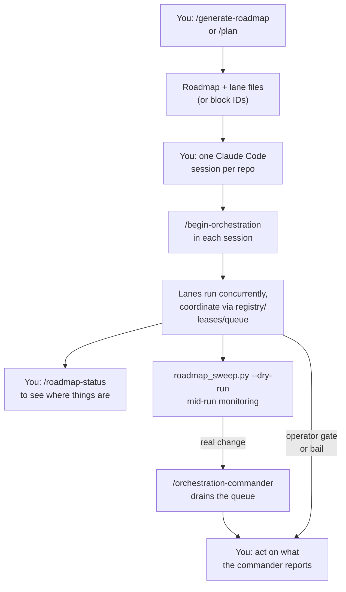

# Orchestration runbook — the whole system, end to end

**New here? Read [`index.md`](index.md) first** — it has the diagram and the vocabulary table this
page assumes. This page is the front door above it: the whole system in one place, linking down
into [`orchestration.md`](orchestration.md) (one lane), [`lane-coordination.md`](lane-coordination.md)
(the layer under several lanes) and [`roadmap-sweep.md`](roadmap-sweep.md) (mid-run monitoring)
rather than restating them. Where this page and one of those three disagree, believe the deeper
page — it owns the detail.

## What an orchestration is

**Plain English:** an orchestration is an agent driving a list of work items — called **blocks** —
to completion, one at a time, checking its own bookkeeping as it goes, and stopping to ask you only
when something genuinely needs a human. One such run, in one repo, is called a **lane**. Several
lanes can run at once, each in its own Claude Code session, each in a different repo, coordinating
through a shared file-based layer rather than talking to each other directly.

## Quickstart

The whole system, shortest path. Steps 1 and 3 are **slash commands** typed into a Claude Code
prompt; step 4 is a **shell** command in a terminal.

1. Make the work: `/generate-roadmap` (many repos) or `/plan` (one repo) — see
   [What you can orchestrate](#what-you-can-orchestrate) for which, and for the `/plan` caveat.
2. Open a Claude Code session **in each repo** that has a lane.
3. In each session: `/begin-orchestration --roadmap planning/roadmaps/<slug>/roadmap.md --lane <name>`
   It prints a plan and stops. Read it, say go.
4. While they run, from a terminal at the brain root:
   `python3 scripts/roadmap_sweep.py --roadmap <slug> --dry-run`
   Start with `--dry-run` — a bare run has live side effects.

Anything that needs you surfaces through the sweep or a notification. Detail on each step is below.

## The whole system, in one picture



**In words:**

1. **You author the work** — a roadmap ([`/generate-roadmap`](../../.claude/commands/generate-roadmap.md))
   or a single-repo initiative ([`/plan`](../../.claude/commands/plan.md)).
2. **That produces lane files** (roadmap case) **or block IDs to pass by hand** (`/plan` case, per
   the gap above).
3. **You open one Claude Code session per repo** that has work.
4. **You type `/begin-orchestration` in each session** — each becomes a running lane.
5. **Lanes run concurrently**, coordinating through the shared registry/lease/queue layer, never
   editing each other's repos directly.
6. **You check in with `/roadmap-status`** whenever you want a live cross-repo view.
7. **`roadmap_sweep.py --dry-run` watches the run** and decides whether anything needs waking.
8. **On real change, the sweep can route to `/orchestration-commander`**, which drains the queue
   and reports what's left.
9. **You act** on whatever a lane's operator gate, a bail, or the commander surfaces.

**What you personally do:** steps 1, 3, 4, 6 (whenever you want a look), and 9 — answering whatever
the run surfaces. Steps 5, 7 and 8 run without you once started; step 2 is a side effect of step 1,
not a separate action.

## What you can orchestrate

Two shapes of work, and the command that produces each:

| Shape | Spans | Made with | Output |
|---|---|---|---|
| **A roadmap** | many repos, many lanes | [`/generate-roadmap`](../../.claude/commands/generate-roadmap.md) | `planning/roadmaps/<slug>/roadmap.md` + one `lane-<name>.json` per repo |
| **A single repo's work** | one repo, one lane | [`/plan`](../../.claude/commands/plan.md) | `planning/<slug>/plan.md` + `planning/blocks/<BlockID>.json` per block |

Both are **slash commands** — typed into a Claude Code session's prompt, not into a shell.

**`/plan` emits a lane file only when you ask for it.** `/generate-roadmap` always writes the
per-repo `lane-<name>.json` files that
[`/begin-orchestration`](../../.claude/commands/begin-orchestration.md) consumes. `/plan` writes one
**only with `--lane`**, because most single-repo initiatives are worked block-by-block by hand and
an extra artifact every run would surprise that caller.

| You ran | To orchestrate it |
|---|---|
| `/plan <slug> --lane` | `/begin-orchestration --roadmap <slug> --lane <slug>` — the lane file is at `planning/<slug>/lane-<slug>.json` |
| `/plan <slug>` (no flag) | `--blocks <id> <id> …` by hand, reading the IDs off `planning/blocks/<BlockID>.json` |

A bare slug resolves because `/begin-orchestration` checks `planning/roadmaps/<slug>/` first and
then falls back to legacy `planning/<slug>/` — the directory `/plan` already writes to. A slug
present in **both** is an error, not a silent preference.

## How to start one lane

Type this in a Claude Code session, opened in the repo you want the work done in:

```
/begin-orchestration --roadmap <path> --lane <name>
```

or, for a `/plan`-authored initiative (no lane file — see the gap above):

```
/begin-orchestration --roadmap <path> --blocks <id> [<id> ...]
```

`--roadmap` is **required and never guessed** — a lane driven against the wrong roadmap is the
hardest mistake here to notice, so the command refuses to infer it. Full flag reference and the
six-phase lifecycle (resolve → isolation → concurrency → confirm → per-block → lane close):
[`orchestration.md`](orchestration.md).

## How to run several lanes at once

**One Claude Code session per repo.** There is no multi-repo launcher — you open a separate
terminal (or tab) for each repo that has work, start Claude Code in it, `cd` into that repo, and
run the "How to start one lane" step above there. A roadmap with work in three repos means three
sessions, each running its own `/begin-orchestration`, at the same time. Lanes never share a
working directory and never talk to each other directly — they coordinate only through the shared
layer described next.

## How to keep track once several are running

This is monitoring, not driving — none of the tools below start or change a lane.

- **[`/roadmap-status --roadmap <slug>`](../../.claude/commands/roadmap-status.md)** — a Claude Code
  slash command, read-only, that joins the lane log, each repo's run-record `notes.md`/`review.md`,
  each spec's `sdlc-*-state.json`, and each repo's `state.json` into one mid-run view of a single
  roadmap: what needs you, what's running or just finished, what stopped and why. Omit `--roadmap`
  to list candidate roadmaps. Writes nothing.
- **The lane log** — `<roadmap-dir>/lane-log.jsonl`, one line per completed block, append-only.
  What `/roadmap-status` reads first. Detail: [orchestration.md § Artifacts](orchestration.md#artifacts).
- **The registry and leases** — who is claiming to be running, and which repo each lane has locked.
  Read-only checkers: [lane-coordination.md Quickstart](lane-coordination.md#quickstart). Full
  detail on the five coordination pieces: [lane-coordination.md §1](lane-coordination.md#1-the-five-pieces).

## When and how you call `/orchestration-commander`

**What it is:** lanes leave each other messages, and generated files fall out of date behind them.
Something has to read that pile, act on it, and tell you what's left — that's the **commander**.
One pass is a **drain**.

**Call it when:** you want to know what's piled up right now, or a lane's notes point at a message
it's waiting on.

**How:**

| | How | When |
|---|---|---|
| **Interactive** | Type [`/orchestration-commander`](../../.claude/commands/orchestration-commander.md) in a Claude Code session | You're at the keyboard. No setup, no arguments, cannot surprise you. |
| **Unattended** | [`./scripts/commander_drain.sh`](../../scripts/commander_drain.sh) `[--repo NAME] [--lane NAME]` — a **shell** command | Cron or scripting. **Always writes to the real shared lock directory — no dry-run.** |

Both run the exact same instructions; the script reads
[`orchestration-commander.md`](../../.claude/commands/orchestration-commander.md) and feeds it to a
Claude turn via `bastion ask`. Full detail, including the "re-derives, never detects" commit rule:
[orchestration.md § The commander](orchestration.md#the-commander) and
[lane-coordination.md §5](lane-coordination.md#5-running-the-commander).

## When and how you run a roadmap-sweep

**Make the distinction crisp: the sweep is mid-run monitoring. It has nothing to do with starting
or planning work.** It watches lanes that are *already running* and decides whether anything needs
a human or a commander — it never opens a lane, never writes a block, never touches `/plan` or
`/generate-roadmap`'s output.

Run it from a **terminal**, at the brain root:

```bash
python3 scripts/roadmap_sweep.py --roadmap <slug> --dry-run
```

`--dry-run` computes the snapshot, the diff and the routing decision without ever calling `bastion
notify` or `commander_drain.sh` — **start with it**. A bare run (no `--dry-run`) has live side
effects: on a real diff it can invoke `commander_drain.sh` for real, which wakes a Claude Code turn
against a persistent tmux session. The script itself is `agentic-portfolio/scripts/roadmap_sweep.py`
— it lives in the **HQ repo**, not here. Full runbook, flags, and the routing table:
[`roadmap-sweep.md`](roadmap-sweep.md).

## Things that happen → what they trigger

| It happens | What the system does | What you do |
|---|---|---|
| A lane hits an **operator gate** | Lane stops, writes an `operator-gate` escalation to both `notes.md` and `escalations.jsonl`, waits | Read the escalation, decide, tell the lane to continue |
| A **block bails** (past its retry budget) | Lane writes a `bail` escalation, does not silently skip it | Decide the block's fate — retry, descope, or hand off |
| **Two blocks disagree** | Lane writes a `disagreement` escalation rather than picking a side | Adjudicate; the lane will not guess |
| A block needs a change in a **repo it doesn't own** | Lane writes a `cross-repo-edit` escalation, pings the owning lane's queue — **never reaches you directly** | Usually nothing — the owning lane resolves it. Check `/roadmap-status` if it stalls |
| A **lease goes stale** | Nothing automatic — `check_lane_agents.py` reports its age but can't tell abandoned from slow | Cross-check against `ListAgents` yourself; see [lane-coordination.md §6](lane-coordination.md#6-troubleshooting) |
| A **queue item sits unread** | Nothing drains it until a commander runs | Run `/orchestration-commander`, or wait for a self-triggering message kind (`RENDEZVOUS`, `LEASE_RELEASE`) |
| A **chain reaches terminal state** | Lane writes the final `review.md`, releases its lease and registry claim, runs `/close-out` | Read `review.md`; nothing else required unless it flags something |
| The **sweep finds a real diff** | Routes per the escalation's declared `channel` — `notification` (buttons) or `session:<slug>` (open-ended) — never invents either | Answer whatever channel it opened |

Full detail on escalation `kind`s and `channel`s: [orchestration.md § Escalation records](orchestration.md#escalation-records).

## Attaching to a tmux session a wake opened

A commander drain — whether you ran it or a sweep triggered it — runs inside a **named tmux
session**, `commander-<repo>-<lane>` (e.g. `commander-brain-main`), stamped by
[`commander_drain.sh`](../../scripts/commander_drain.sh) (`SESSION="commander-${REPO_NAME}-${LANE}"`).

**Look before you attach — `bastion capture` is read-only, `bastion attach` takes over your
terminal:**

| Verb | What it does | Shell or Claude Code? |
|---|---|---|
| `bastion sessions` | List every tmux session, with each pane's last line | shell |
| `bastion capture <session>` | Print recent pane output **without** attaching — usually what you want first | shell |
| `bastion attach <session>` | Attach your terminal to the session | shell |
| `bastion kill <session>` | Kill a session | shell |
| `bastion send <session>` | Send a command to a session without attaching | shell |
| `bastion new` | Create a new detached session | shell |

All of these are **shell** commands, run in a terminal — not Claude Code slash commands. Plain
`tmux attach -t <name>` also works if `bastion` isn't handy. Run `bastion <verb> --help` for the
full flags of any of them.

```bash
bastion sessions                          # what's running right now
bastion capture commander-brain-main      # peek at it first
bastion attach commander-brain-main       # then attach, if you need to interact
```

## Troubleshooting the whole system

| Symptom | Likely cause | What to check |
|---|---|---|
| `/begin-orchestration` prints usage and stops | `--roadmap` was omitted — never inferred, on purpose | Pass `--roadmap <path>` explicitly |
| A `/plan`-authored initiative won't drive through `/begin-orchestration` | No lane file exists for it (the gap above) | Pass `--blocks <id> <id> …` instead of `--lane` |
| Two lanes seem to be fighting over the same repo | Duplicate exclusive lease | [lane-coordination.md §6](lane-coordination.md#6-troubleshooting) — `check_lane_agents.py` names both claimants |
| A lane is stuck and you don't know why | It's waiting at an operator gate or a bail, or a message it sent is undrained | `/roadmap-status --roadmap <slug>`; then check that lane's `notes.md` and the queue per [lane-coordination.md §4](lane-coordination.md#4-sending-and-receiving) |
| You ran the sweep and a tmux session appeared that you didn't expect | A bare run (no `--dry-run`) hit a real diff and routed to a commander | Expected if you omitted `--dry-run`; `bastion capture` it, kill it by hand if unwanted — see [roadmap-sweep.md Troubleshooting](roadmap-sweep.md#troubleshooting) |
| The sweep or a drain seems to hang | It routed to a session or peer queue and is waiting on `commander_drain.sh`'s own timeout (up to 930s) | Not hung — bounded; `bastion capture` the session to see progress |
| All four `validate-brain` flags are red, naming a file you didn't touch | Concurrent lane wrote frontmatter with a displaced `---` fence | [lane-coordination.md §6](lane-coordination.md#6-troubleshooting) — the repo named is often just the first the sweep reached |
| A fix you made mid-run doesn't seem to take effect | The running session's engine/command snapshot predates your edit | `base-template/CLAUDE.md` standing rule 10 — a running session is a launch-time snapshot; only a restart picks up the change |
| Nothing schedules a drain or a sweep | The commander drain is still manual. The sweep now has a lock-guarded cron wrapper (`agentic-portfolio/scripts/roadmap_sweep_cron.sh`) but it is **not installed** — a deliberate operator decision, not a gap; see [roadmap-sweep.md § Scheduling](roadmap-sweep.md#scheduling--the-lock-and-why-it-exists) | Run [`/orchestration-commander`](../../.claude/commands/orchestration-commander.md) or the sweep by hand |

## See also

- [`index.md`](index.md) — the whole-system diagram (engine-level) and the vocabulary table this
  page assumes.
- [`orchestration.md`](orchestration.md) — one lane's full lifecycle: the six phases, artifacts,
  escalation records, and traps.
- [`lane-coordination.md`](lane-coordination.md) — the registry/lease/queue layer several
  concurrent lanes coordinate through, plus commander setup and troubleshooting.
- [`roadmap-sweep.md`](roadmap-sweep.md) — the sweep's own runbook: flags, the snapshot/diff/route
  pipeline, and the escalation routing table.
- [`/generate-roadmap`](../../.claude/commands/generate-roadmap.md) · [`/plan`](../../.claude/commands/plan.md) — the two ways to author work to orchestrate.
- [`/begin-orchestration`](../../.claude/commands/begin-orchestration.md) · [`/orchestrate`](../../.claude/commands/orchestrate.md) — the commands that drive a lane.
- [`/orchestration-commander`](../../.claude/commands/orchestration-commander.md) · [`/roadmap-status`](../../.claude/commands/roadmap-status.md) — draining the queue, and reading a live roadmap.
- `agentic-portfolio/scripts/roadmap_sweep.py` — the sweep script (HQ repo).
- [`scripts/commander_drain.sh`](../../scripts/commander_drain.sh) — the unattended commander wrapper that names the tmux session.
