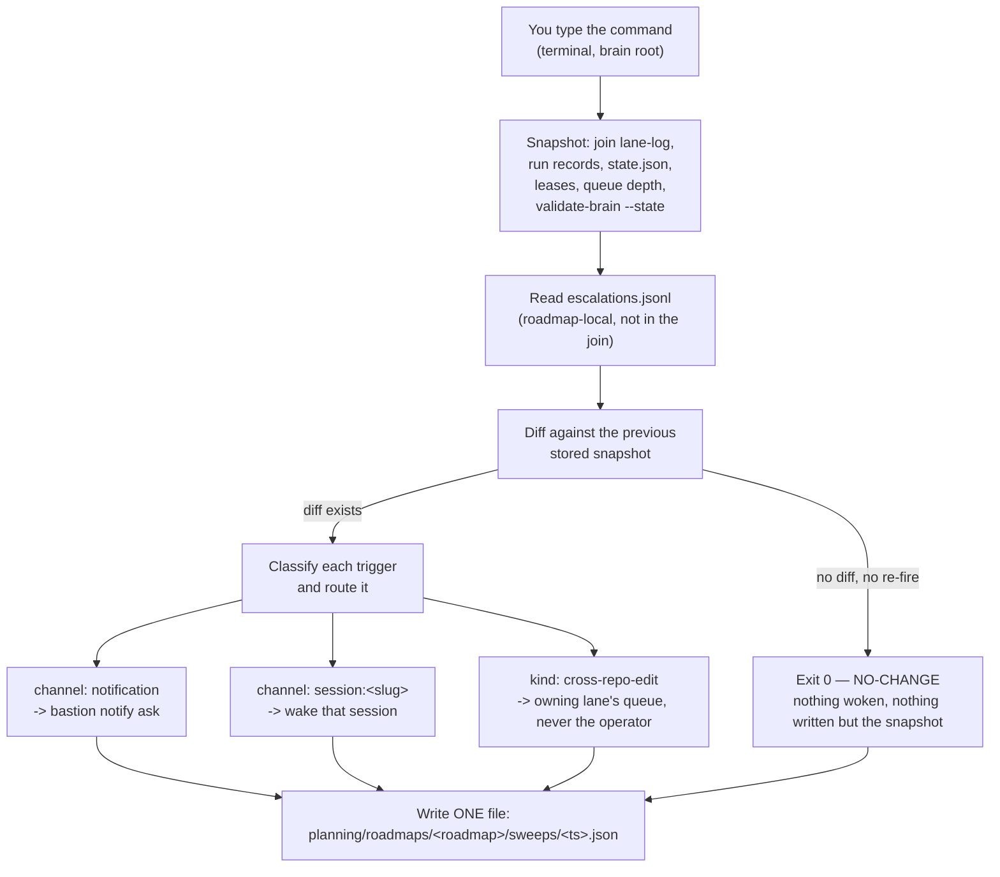

# Roadmap sweep — the scripted liaison

**New here? Read [`index.md`](index.md) first** — diagram and vocabulary for the whole
orchestration layer. Then [`orchestration.md`](orchestration.md), which is the layer this sweep
watches over.

## What this page is for

**The sweep replaces the full-time liaison agent.** It snapshots one roadmap's live state, diffs
that against the previous snapshot, and **wakes an agent only when something really changed.** No
diff, no wake, no cost — where the liaison burned a turn on ~14 of 24 passes finding nothing.

## Quickstart

Run this from a **terminal**, from the brain root (`agentic-portfolio/`) — **not** as a Claude
Code slash command, and not from inside `base-template/`:

```bash
python3 scripts/roadmap_sweep.py --roadmap <slug> --dry-run
```

**Start with `--dry-run`.** It computes the snapshot, the diff, and every routing decision, and
still writes the one snapshot file below — but it never calls `bastion notify` or
`commander_drain.sh`. (The **commander** is the agent that drains a lane's message queue and
reports what needs you; `commander_drain.sh` is the wrapper that wakes one. See
[lane-coordination.md §5](lane-coordination.md#5-running-the-commander).) A bare run (no `--dry-run`) has **live side effects**: on a real diff it can
invoke `base-template/scripts/commander_drain.sh` for real, which wakes a Claude Code turn against
a persistent tmux session. Running it bare during review spawned a live `commander-brain-main`
session that had to be killed by hand — that is not a hypothetical risk, it is what happened.

| Must exist first | If it doesn't |
|---|---|
| `brain.toml` somewhere above your cwd (or pass `--root PATH`) | `roadmap_sweep.py: could not resolve brain root`, exit 2 |
| `planning/roadmaps/<roadmap>/` for the slug you passed | the script has nothing to snapshot for that roadmap |
| `bastion` on `PATH` (only needed for a non-dry-run notification route) | the notify call fails and is recorded in the snapshot, not raised |

The script itself: `agentic-portfolio/scripts/roadmap_sweep.py`. It lives in the **HQ repo**, not
in this one — cite it as a bare backticked path from here, never a relative link.

```
python3 scripts/roadmap_sweep.py --roadmap <slug> [--root PATH] [--refire-hours N] [--dry-run] [--quiet]
```

> **`--dry-run` is bracketed above because it is optional to the parser, not because it is optional
> to you.** Omitting it is the live path: on a real diff this wakes a Claude Code turn and can spawn
> a tmux session. Add it unless you specifically intend that.

| Flag | What it does |
|---|---|
| `--roadmap <slug>` | required — which `planning/roadmaps/<slug>/` to sweep |
| `--root PATH` | brain root override, if cwd isn't under one |
| `--refire-hours N` | hours before an unresolved **blocking** escalation re-fires (default 6.0); an **advisory** escalation never auto-re-fires |
| `--dry-run` | compute and store the snapshot/diff/routing decisions, never call `bastion` or `commander_drain.sh` — **the safe path; use it unless you mean to wake something** |
| `--quiet` | suppress the per-run summary line |

## How a sweep works



1. You run the command above, in a terminal, from the brain root.
2. The script stamps the pass with the current UTC time and builds a **snapshot** — one read-only
   join of lane-log, per-repo run records, `sdlc-*state.json`, lease/registry state, message-queue
   depth, and one `bastion validate-brain --state` call (corpus-wide, not per-repo). It also reads
   the roadmap's own `escalations.jsonl`, which sits outside that join.
3. It **diffs** this snapshot against the immediately preceding one stored for this roadmap (or a
   synthetic empty baseline on the first-ever sweep). The diff compares a *semantic projection* of
   the state, not the raw snapshot — a growing age or a moving timestamp alone does not count as a
   change, so three consecutive quiet runs all report `NO-CHANGE` rather than false-waking on
   nothing but the clock.
4. **No diff and no escalation crossing its re-fire threshold → exit 0, nothing woken, nothing
   notified.** This is the entire point of the script — a quiet sweep takes about 3.3 seconds.
5. A diff exists → each fired trigger (a new escalation line, a re-fired standing one, or a bare
   state/lease/queue/validate-brain drift with no escalation behind it) is classified and routed —
   see the table below.
6. **Exactly one file is ever written**, regardless of outcome:
   `planning/roadmaps/<roadmap>/sweeps/<ts>.json`, holding the raw snapshot, the diff, and the
   routing outcome. Nothing else is written anywhere, on any path, including `--dry-run`.

A routing pass that has to actually call `commander_drain.sh` (routing to `session:<slug>` or
resolving a `cross-repo-edit`) can block the terminal for up to **930 seconds (15.5 minutes)** —
that call has its own internal timeout and the sweep waits on it.

## What it routes, and what it refuses to decide

The sweep **routes; it never decides.** `channel` and `kind` are read verbatim off the escalation
record — the script never invents, reduces, or infers either.

| Signal | Routed to |
|---|---|
| `channel: notification` | `bastion notify ask`, using the `options` the lane already declared on the record — never a generic yes/no the script invents |
| `channel: session:<slug>` | that session is woken directly with one pointer line — never reduced to buttons |
| `channel` missing or malformed | treated as `session` — **fail toward the richer channel, never degrade downward** |
| `kind: cross-repo-edit` | the owning lane's queue, via `commander_drain.sh` for that lane — **never the operator**; it's an ownership question a peer lane resolves |
| an escalation whose `verified_at_sha` is behind current HEAD | routed, but flagged `stale: true` — relayed as "re-verify before acting," never as a live fact |
| no diff | exit 0, nothing woken |

Full record shape: `base-template/scripts/escalation.schema.json`.

Two things the script never does, on purpose — a peer lane or a human still has to:

- **Author a novel claim to a peer.** Every payload the script sends is built only from fields
  already on the escalation record, or the bare fact that a diff exists.
- **Decide whether to interrupt a block in flight.** The sweep wakes; it does not judge urgency
  beyond what the record's own `severity` and `channel` already say.

## Restraint

Reaching the operator at all is governed by
[`notify-operator`](../../.claude/skills/notify-operator/SKILL.md) — read it rather than trust a
summary of it here. In short: only a decision only the operator can make with the lane blocked on
it, a run-stopping failure the lane can't recover from, or a long chain reaching its terminal
state justify a send. At most one send per sweep, deduped so a standing gate doesn't re-fire every
pass, and a `timeout` on `bastion notify ask` is never treated as an approval.

This restraint exists because the predecessor channel — a Claude Code `Stop`/`Notification` hook
that fired on every session stop — was retired for exactly the failure this guards against: a
channel that fires too often trains its audience to stop reading it.

## Scheduling — not built yet

**There is no cron job, hook, or wrapper that runs this on a schedule.** Every invocation today is
manual. The open question is what triggers a sweep automatically: a lane-boundary hook firing on
real *events* covers most cases, but says nothing about *absences* — a stale lease or a dead
heartbeat that produces no event to hook into — so a periodic run is still needed as a dead-man's
switch for those. If a scheduled version is built, it needs a **lockfile**: a routing pass can
block for up to 930 seconds, and two overlapping passes must not stack.

## Troubleshooting

| Symptom | Likely cause | What to check |
|---|---|---|
| `roadmap_sweep: could not resolve brain root...` | not run from under a `brain.toml` tree, and `--root` not passed | run from `agentic-portfolio/`, or pass `--root PATH` explicitly |
| Sweep runs but nothing is written | should not happen — exactly one file is always written | check `planning/roadmaps/<roadmap>/sweeps/` exists and is writable; check stderr for a caught exception (exit 2) |
| A `commander-brain-main` (or similar) tmux session appeared unexpectedly | a bare run (no `--dry-run`) hit a real diff and routed to a session | kill the session by hand if unwanted; re-run with `--dry-run` next time to see the decision first |
| Sweep takes ~15 minutes | it routed to a session or a cross-repo-edit peer queue and waited on the full `commander_drain.sh` timeout | expected — it is bounded at 930s, not hung; check the written snapshot's routing outcome once it returns |
| An escalation is routed but marked `stale` | `verified_at_sha` on the record is behind current HEAD | re-verify the claim yourself before acting; do not treat it as current fact |
| Notification never reaches the operator | `bastion` not on `PATH`, or the notify call itself errored | check stderr and the snapshot's routing outcome for `"status": "error"` |

## See also

- [`index.md`](index.md) — vocabulary and the whole-system diagram.
- [`orchestration.md`](orchestration.md) — the lane lifecycle this sweep watches over.
- [`lane-coordination.md`](lane-coordination.md) — the registry, leases, and message queue the
  snapshot reads from.
- `agentic-portfolio/scripts/roadmap_sweep.py` — the script itself.
- `base-template/scripts/commander_drain.sh` — what actually wakes a session.
- `base-template/scripts/escalation.schema.json` — the escalation record shape.
- `agentic-portfolio/scripts/roadmap_status_discovery.py` — the join the snapshot step re-uses.
- [`.claude/skills/notify-operator/SKILL.md`](../../.claude/skills/notify-operator/SKILL.md) — the restraint rules for reaching the operator.
- `agentic-portfolio/planning/scripted-liaison-sweep/design.md` — the design this script implements.
