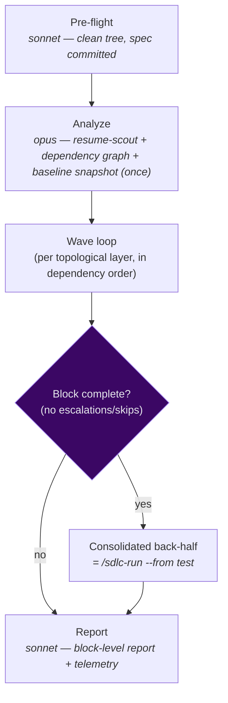
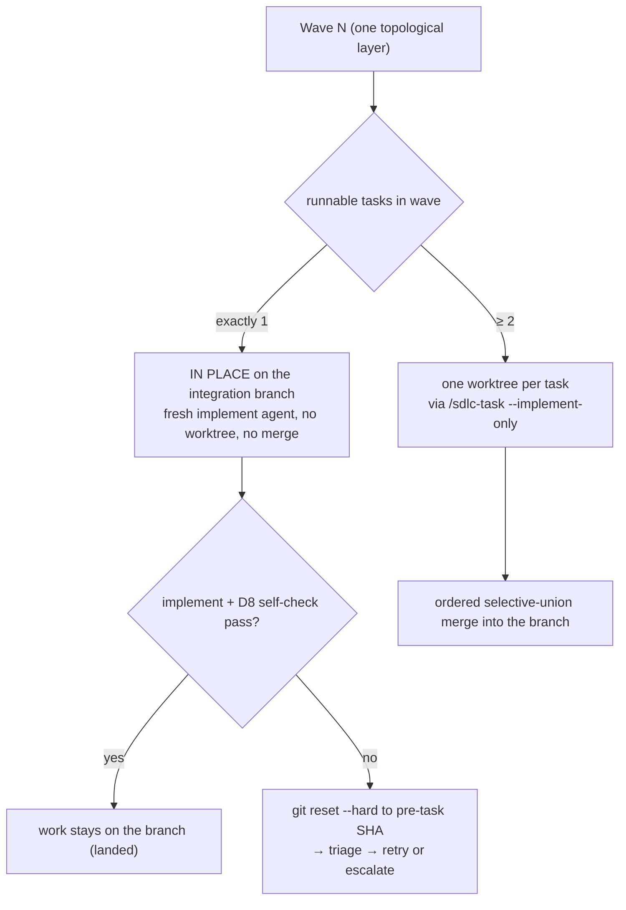

# `/sdlc-block` — lean spec orchestrator

Drives an **entire spec** (`planning/<spec>/tasks.md`) to completion in one invocation. It shares setup
once, runs a **fresh implement agent per task** across dependency-ordered waves, then verifies the whole
integrated tree with **one consolidated back-half**. It merges every wave for you and applies a single
authoritative `status.md`/`log.md` update at the end.

Think of it as **"a more powerful `/sdlc-run`"**: the per-task cost is implement (+ optional localization
review) only, and the expensive test → review → fix → document → wrap-up runs **once**, over the
integrated result, not per task.

Engine: [`.claude/workflows/sdlc-block.js`](../../.claude/workflows/sdlc-block.js)

> **This page describes the lean F3 design** ([D22](../../planning/decisions/D22-execution-plan-authored-at-generate-tasks.md)–[D28](../../planning/decisions/D28-sdlc-block-task-state.md)).
> Earlier docs describing "a full `/sdlc-task` pipeline per task per wave" are obsolete — that model was
> replaced wholesale. The byte-identity guardrail no longer binds this workflow.

---

## Usage

```
/sdlc-block <spec-slug>                       run every task in the spec
/sdlc-block <spec-slug> 1-7                   run only tasks 1–7 (positional range)
/sdlc-block <spec-slug> --tasks 1,3,5-7       same idea, explicit flag (list + range)
/sdlc-block <spec-slug> --max-wave-width 6    widen parallelism for a trusted spec
/sdlc-block <spec-slug> --max-retries 3       more attempts per task before escalation
/sdlc-block <spec-slug> --verify-depth consolidated+review   add a per-task localization review
```

| Argument | Meaning | Default |
|---|---|---|
| `<spec-slug>` | **Required.** Drives every `planning/<spec-slug>/…` path. Fully general — works for any spec. | — |
| `[range]` | Optional task selection: 2nd positional **or** `--tasks`. Forms: `1-7`, `1,3,5`, `1-3,7`, `5`. | all tasks |
| `--max-retries N` | Total attempts per task before escalation. | `2` |
| `--max-wave-width W` | Max tasks run concurrently per batch (worktree waves only). | `3` |
| `--verify-depth <d>` | Per-task verification depth ([D24](../../planning/decisions/D24-consolidated-back-half.md)): `consolidated` (per-task review **off**) or `consolidated+review` (one **non-gating** localization review per task). CLI overrides `harness.json` `block.verify`. | `consolidated` |

`--verify-depth` resolves as **CLI flag → `harness.json` `block.verify` → `consolidated`**. The
consolidated back-half is authoritative either way; per-task review only produces a localization map for
the consolidated fix.

---

## Phases



### 0 · Pre-flight — guarantee a clean tree with the spec committed
Runs once on the integration branch. It kills a specific failure chain: a `tasks.md` written but not
committed would block every wave merge (the clean-tree guard) and make worktrees branch off a commit that
lacks the spec.

| Tree state | Action |
|---|---|
| `tasks.md` **missing** | Generate it from `master-plan.md`, then commit. |
| `tasks.md` present, **uncommitted** (spec dir only) | `git add planning/<spec>/` + commit. |
| Any **unrelated** file dirty (outside the spec dir) | **Abort fast**, listing the files. |
| clean + present | no-op |

It also runs the [D16](../../planning/decisions/D16-preflight-task-structure-lint.md) task-structure lint
(abort if `tasks.md` has no `### N.` headings) and the [D19](../../planning/decisions/D19-property-based-authoring-guard.md)
thin-spec guard.

### 1 · Analyze — derive the graph, snapshot baselines, load resume state
The single most important reliability step. **An agent emits a dependency graph *with evidence***
(per task: `filesCreated`, `filesModified`, `dependsOn`, and the quote from `tasks.md` proving each edge,
plus an additive/exclusive classification of each shared file); **deterministic JS computes the waves** by
topological layering. The agent biases conservative — when unsure an edge exists, include it; when unsure
a file is additive, treat it as exclusive.

- **Execution plan ([D22](../../planning/decisions/D22-execution-plan-authored-at-generate-tasks.md)):**
  if `/generate-tasks` already authored `sdlc/execution-plan.json`, Analyze **loads it** (skips the
  expensive derivation) after validating it parses, has the right shape, and its task set exactly matches
  the current `### N.` headings. A stale plan (tasks added/removed/renumbered) is rejected and the graph
  re-derived.
- **Baseline snapshot ([D6](../../planning/decisions/D6-harness-richer-checks.md)/[D23](../../planning/decisions/D23-lean-block-shared-setup.md)):**
  pre-block baselines for any baseline-diff validation checks are captured **once** (and committed, so the
  tree stays clean for merges), before any task implements.
- **Breakdown assessment ([D10](../../planning/decisions/D10-breakdown-assessment.md)/[D13](../../planning/decisions/D13-breakdown-heuristic-homogeneity.md)):**
  each task is assessed once for coarseness; per `harness.json` `breakdown.mode` it is recommended,
  auto-generated, or off. (Per-task re-assessment is suppressed in the child runs.)
- **Resume scout + block state ([D28](../../planning/decisions/D28-sdlc-block-task-state.md)):** classifies
  each task's existing worktree/branch, and reads the `sdlc-block-state.json` breadcrumb (if any) to skip
  re-running landed tasks and re-triaging escalated limbo worktrees — see [Resumption](#resumption).

### 2 · Wave loop — in-place for width 1, worktrees for width ≥ 2
This is the heart of the lean design ([D23](../../planning/decisions/D23-lean-block-shared-setup.md)).
Isolation is used **only for genuine concurrent writers**:



- **Width-1 wave → in place.** A fresh implement agent runs directly on the integration branch (no
  worktree, no merge). The pre-task HEAD is captured; a failed implement is `git reset --hard`'d back
  before any retry. This is the common lean path.
- **Width-≥2 wave → worktrees.** Each task runs via `/sdlc-task --implement-only` (+ `--review` when
  `consolidated+review`) in its own worktree, then the branches **merge in task-number order** with a
  selective-union strategy (additive shared files union safely; a real exclusive-file conflict aborts and
  escalates the task — never auto-resolved).
- **Retry + triage.** A non-passing task is classified by a triage agent before any retry: transient or
  *progressing* failures (different failing criteria than last time) get a clean-slate retry up to
  `--max-retries`; a *stuck* failure (same criteria) or a structural one escalates. When unsure, triage
  prefers escalation (cheap) over a wasted retry (expensive).
- **Poison the subtree, not the block.** Because the orchestrator holds the real dependency graph, an
  escalation skips **only** the dependent subtree; every independent task keeps running.

### 3 · Consolidated back-half — verify the integrated tree once
Runs **only when the block is complete this run** (no escalated/skipped tasks). It is literally
[`/sdlc-run <spec> --from test`](sdlc-run.md) ([D24](../../planning/decisions/D24-consolidated-back-half.md)):
one `test → review → fix → (ui-test) → document → wrap-up` over the integrated result. It first seeds a
spec-level `implement.md` from the per-task implement reports so the consolidated review/fix can localize
each finding to the task that produced it. That back-half's wrap-up owns `status.md`/`log.md`/the spec
Amendment Log — the block's own Report does not touch them.

This replaces the old per-task back-half (~113k tokens × N tasks → **one** pass).

### 4 · Report — block-level facts only
Writes `sdlc/reports/block-workflow.md`: per-task outcomes (result / verdict / merge strategy / commit),
an Escalations section with worktree paths + review reports, the breakdown assessment, the token roll-up,
and the resume command. Overall verdict: **PASS** (all selected tasks landed + back-half PASS) /
**PARTIAL** (some escalated/skipped) / **BLOCKED** (nothing landed).

---

## Resumption

Re-run `/sdlc-block <spec-slug>` (same or different range). State comes from three layers, in order of
authority:

1. **Committed reports** — a task whose `taskN-implement.md` is committed on the integration branch is
   "landed" and skipped.
2. **Worktree resume-scout** (Analyze) — classifies each existing worktree: `complete-unmerged-pass`
   (merge as-is), `complete-unmerged-fail` (escalate, preserve), `partial-post-implement` (resume in
   place via `--resume`), `partial-pre-implement` (teardown + fresh).
3. **Block state breadcrumb** ([D28](../../planning/decisions/D28-sdlc-block-task-state.md)) —
   `sdlc/sdlc-block-state.json` records per-task `pending`/`merged`/`escalated`/`skipped`, written after
   Analyze and once per wave. On re-invocation it **additively augments** the above: `merged` tasks skip
   the wave loop; `escalated` tasks escalate **directly** instead of being re-derived through a triage
   wave. It augments, never replaces, the committed-report scout, and is **gitignored** (runtime state).

If a selected **range** omits a prerequisite not yet done, Analyze warns up front (e.g. "task 4 needs task
7") rather than failing mid-run.

> The back-half's emoji gate diffs `main..HEAD`; when the block runs **on `main`** that diff is empty and
> the gate no-ops. Run the block on a **dedicated integration branch** off `main` (merged at the end) to
> keep emoji gating live and isolate in-place `git reset --hard` rollback from `main`.

---

## Failure handling

```
Task 7 escalates  →  Task 4 (dependsOn 7) is SKIPPED
                  →  Tasks 2,3,5,6,8,9,10 (independent) still run and land
```

Escalations **block the consolidated back-half** (it fires only once everything has landed). Fix the
blocker — or hand-edit `execution-plan.json` — and re-run; the back-half fires on the next complete run.
Escalation **preserves** the worktree/branch for inspection; a clean-slate retry tears down the failed
attempt first.

---

## Choosing `--max-wave-width`

Width barely affects **total** tokens (every task runs eventually); it controls **peak token rate,
failure blast radius, and merge complexity**. Worktree concurrency is capped at ~`min(16, cores−2)` slots
**shared** across the orchestrator and all child runs, and the token budget is shared too — wide waves
interleave through those slots rather than truly running N×.

- **Default `3`** — a real wall-clock win; a systemic problem burns at most 3 implements before the merge
  checkpoint catches it.
- **Raise to `4–6`** once a spec's plan is trusted.
- **Drop to `1`** to force strictly sequential waves for debugging.

---

## Token usage

The orchestrator spends across: shared setup (pre-flight + Analyze + baseline-snapshot, **once**), a fresh
implement per task (+ optional review), merges/triage as needed, then **one** consolidated back-half. Per
[D23](../../planning/decisions/D23-lean-block-shared-setup.md)/[D24](../../planning/decisions/D24-consolidated-back-half.md)
the per-task cost is implement-only — the budget guard estimates **~55k/task** (`consolidated`) or
**~90k/task** (`consolidated+review`).

| Stage | Model | Frequency | Typical tokens |
|---|---|---|---|
| pre-flight | sonnet | once | _TBD_ |
| Analyze (graph derive) | opus | once | ~3.5k out (measured re-derive, no plan present) |
| baseline-snapshot | haiku | once | _TBD_ |
| implement (per task) | sonnet | per task | ~55k (budget estimate) |
| per-task review (optional) | sonnet | per task | +~35k (→ ~90k) |
| merge (per worktree task) | sonnet | width-≥2 waves | _TBD_ |
| triage (per failure) | sonnet | on failure | ~6k each |
| consolidated back-half | mixed | once | ~one `/sdlc-run` |
| state write | haiku | once per wave | _TBD_ |

**Measured end-to-end** — `expose-api-and-telegram-bot` (5 tasks; the D23/D24 validation run):

| Run | Agents | Subagent tokens | Duration | Outcome |
|---|---|---|---|---|
| Run 1 (PARTIAL) | 21 | 531,325 | 19m | wave-1 merge blocked by an untracked baseline (fixed: [P0/D28 setup commit](../../planning/decisions/D28-sdlc-block-task-state.md)) |
| Run 2 (PASS) | 47 | 1,344,140 | 70m | all 5 tasks + back-half |

The restart cost ~531k tokens of pure waste — the motivation for [D28](../../planning/decisions/D28-sdlc-block-task-state.md)
block-state persistence (skip re-derive + the ~12k triage wave on resume). Use `--max-wave-width 1` and
`consolidated` (no per-task review) for the leanest run; widen / add review only when end-only
localization is hard. Telemetry roll-up is written into `block-workflow.md` each run.

---

## Relationship to the other engines

- **[`/sdlc-task`](sdlc-task.md)** — the per-task building block, used only for width-≥2 waves
  (`--implement-only`). Still usable standalone.
- **[`/sdlc-run`](sdlc-run.md)** — *is* the consolidated back-half (`--from test`).
- **`/clean-worktree`** — the manual single-branch merge; `/sdlc-block` performs the equivalent inline,
  so you never merge block tasks by hand.
