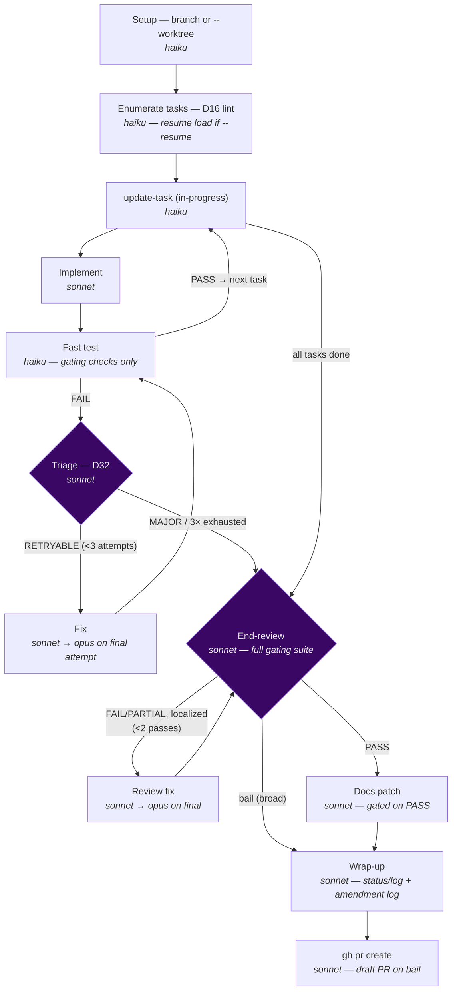

# `/sdlc-flow` — single-branch, PR-terminating SDLC engine

The default engine for non-trivial feature work. Runs every task in a spec **sequentially on one
shared branch** — so there are no inter-task merge conflicts — with a per-task
`implement → fast-test → fix` loop, **one** consolidated review over the integrated tree at the end,
a surgical docs patch, and a **pull request** as the terminal step.

Compared with `/sdlc-task`, `/sdlc-flow` trades per-task independence for a single consolidated
review over the integrated tree, a docs patch, and a PR as the terminal step rather than a bare
commit.

## Isolation mode — branch (default) vs `--worktree`

By **default**, `/sdlc-flow` creates the `<spec>-flow` branch and checks it out **in the main working
tree** — no `trees/` worktree, no sparse-checkout. This keeps a relative `planning/` symlink
(brain-vaulted repos) intact, which a sparse-checkout worktree breaks. `main` stays on the branch
until the PR merges; a fresh run refuses to start on a **dirty** working tree (commit or stash first,
or use `--worktree`).

Pass **`--worktree`** to run in an isolated sparse-checkout worktree under `trees/<spec>-flow/`
instead — the original behavior. Reach for it when you need true isolation: notably `/orchestrate`,
which fans out concurrent `/sdlc-flow` children and therefore always passes `--worktree` so parallel
blocks don't collide in one working tree.

Everything downstream (the per-task loop, review, docs, wrap-up, PR) is identical in both modes; only
the checkout location differs. In branch mode the "worktree path" the engine reports is simply the
repo root.

Engine: [`.claude/workflows/sdlc-flow.js`](../../.claude/workflows/sdlc-flow.js)

---

## Usage

```
/sdlc-flow <spec-slug>                         run every task in the spec, open a PR, stop
/sdlc-flow <spec-slug> 1-3                     scope to tasks 1 through 3
/sdlc-flow <spec-slug> 1,3,5                   scope to specific tasks
/sdlc-flow <spec-slug> 1-3,7                   range plus an extra task
/sdlc-flow <spec-slug> --tasks 1-7             explicit flag form (same as positional range)
/sdlc-flow <spec-slug> --auto-merge            merge the PR + clean up + emit-state on clean PASS
/sdlc-flow <spec-slug> --no-pr                 stop after wrap-up; do not create a PR
/sdlc-flow <spec-slug> --worktree              run in an isolated worktree (default: plain branch)
/sdlc-flow <spec-slug> --resume                re-attach the branch/worktree; skip already-passed tasks
/sdlc-flow <spec-slug> --test-depth full       run the full gating suite per task (default: fast)
```

| Argument | Meaning | Default |
|---|---|---|
| `<spec-slug>` | **Required.** The spec directory name — drives every `planning/<spec-slug>/…` path. | — |
| `[range]` | Optional task selection as the 2nd positional token or via `--tasks`. Forms: `1-7`, `1,3,5`, `1-3,7`, `5`. | all tasks |
| `--tasks <range>` | Equivalent to the positional range. | — |
| `--auto-merge` | After a clean PASS, merge the PR, delete the branch (tear down the worktree too under `--worktree`), and run `mev emit-state --write` on the base. Only fires on a non-draft PR with a PASS verdict and an independently-verified `prOutcome === 'created'` — never on bail. See [PR-stage outcome vocabulary](#pr-stage-outcome-vocabulary). | off |
| `--no-pr` | Stop after wrap-up; leave the branch for a manual PR (or `/close-out --merge-branch`). | off (create PR) |
| `--worktree` | Run in an isolated sparse-checkout worktree under `trees/<spec>-flow/` instead of a plain branch in the main tree. Needed for concurrent runs (e.g. `/orchestrate` children). | off (plain branch) |
| `--resume` | Re-attach the existing branch/worktree and skip tasks whose `state.json` status is `passed`. | off |
| `--test-depth fast\|full` | Per-task validation depth. `fast` runs only `gates:true` checks (the tripwire); `full` runs the whole suite per task. | `fast` |

> All CLI flags override the corresponding `flow.*` config key in `planning/harness.json`. The config
> sets the per-project default; the flag overrides it for one run.

---

## Pipeline



| Stage | Model | What it does |
|---|---|---|
| **Setup** | haiku | Creates (or re-attaches on `--resume`) the `<spec>-flow` branch for the whole spec. **Branch mode (default):** `git checkout -b` in the main tree (aborts on a dirty tree). **`--worktree`:** an isolated git worktree applying the D5/P5 cone-all-tracked-dirs recipe. Checks for unfilled tokens (D19 thin-spec guard) on a fresh run. |
| **Enumerate** | haiku | Reads `tasks.json` for its task entries (D16 preflight lint). If `tasks.json` is missing/invalid/empty but `tasks.md` has a derivable step list, derives a fresh D45-shaped `tasks.json` and commits it before re-enumerating; refuses to run only when nothing is derivable either — see [D16 preflight — derive, then abort](#d16-preflight--derive-then-abort) below. On `--resume`, reads the on-disk (uncommitted) `sdlc-flow-state.json` to identify already-passed tasks and skip them. |
| **update-task** | haiku | Marks the current task in-progress in `tasks.md` (surgical checkbox edit). Disk-only, like the state-writer — neither commits. |
| **Implement** | sonnet | Executes task N against the spec (and `breakdown.md` if present). Runs the D8 completeness self-check before committing `feat:`. |
| **Fast test** | haiku | Runs the `gates:true` checks from `harness.json` (the per-task tripwire). Falls back to the spec's `## Validation Commands` if no config. Also runs the universal emoji gate on changed markdown. |
| **Triage** | sonnet | Classifies a test failure as `RETRYABLE` (transient, or the failure changed — progress is possible) or `MAJOR` (an immediate-bail reason fires, or no progress). Before asserting a pre-existing/baseline claim, the failing check must be re-run against base state (`evidence` + `baseStateChecked` fields record this); otherwise the claim must be phrased as an explicit hypothesis. Harness-created workspace state is a candidate cause, not a fixed backdrop. See [D32](../../planning/decisions/D32-triage-gated-bail.md). Bail means: break to end-review with `draft` flag. |
| **Fix** | sonnet | Targeted fix for the failing checks only — never a re-implement. Escalates to `opus` on the final attempt (`ESCALATION_MODEL`). |
| **End-review** | sonnet | ONE consolidated review over the integrated tree. Re-runs the **full** gating suite (authoritative). Reads `git diff <prBase>..HEAD` + `tasks.md` acceptance criteria + the on-disk (uncommitted) `state.json` as the localization index. Verdict: `PASS` / `PARTIAL` / `FAIL`. |
| **Review fix** | sonnet | Bounded fix for localized end-review findings. Escalates to `opus` on the final pass. A broad or structural finding bails instead (triage decision). |
| **Docs patch** | sonnet | Surgical `--patch` of affected doc files. **Hard-gated on a PASS verdict.** Skipped entirely on bail. |
| **Wrap-up** | sonnet | Updates `status.md` (an **append-only** edit — adds one new line under "Current focus" recording this run's outcome; a prior block's narrative survives verbatim, with the one exception that this spec's own leftover line from an earlier partial run may be replaced in place) + appends the `log.md` entry + writes D18 Amendment-Log entries — all **on the flow branch** (so they ride in the PR and merge atomically with the code). On a fully-done block, also flips `planning/state.json`'s block status to `"closed"` on the branch. It does **not** run `mev emit-state --write` in either mode (a worktree refuses it; a plain feature branch is not the base) — `focus.next` stays **deferred**, still pointing at the pre-close state, until the branch merges via `/clean-worktree`, `/merge-train`, or `/close-out --merge-branch` and runs `mev emit-state --write` on the base; the engine's own log line says so explicitly rather than leaving it silently stale ([D50](../../planning/decisions/D50-sdlc-engines-flip-block-status-on-close.md), [D51](../../planning/decisions/D51-sdlc-flow-branch-default.md)). |
| **PR** | sonnet | Pushes the branch and runs `gh pr create --base <prBase>`. Builds the PR body from the on-disk (uncommitted) `state.json` (per-task summary, verdict, open items). Opens a **draft** PR on bail. Degrades gracefully when `gh` is absent — prints the branch name and the exact commands. Reports one of three `prOutcome` values (`'created'`/`'impossible'`/`'failed'`), which the engine then independently re-verifies via its own `gh pr view` rather than trusting on faith — see [PR-stage outcome vocabulary](#pr-stage-outcome-vocabulary). |

### Per-task retry loop

`update-task → implement → fast-test →` **PASS: next task** or **FAIL: triage →** `RETRYABLE: fix →
fast-test` (up to **3 total attempts**), or `MAJOR: bail to end-review`. The final fix attempt
escalates to `opus`. Exhausting the attempt cap also bails.

### End-review fix loop

`end-review →` **PASS: docs** or **FAIL/PARTIAL (localized): review fix → end-review** (up to
**2 fix passes**, `opus` on the last). A broad or structural finding from triage skips the fix loop
and bails straight to wrap-up (draft PR).

---

## Validate-then-commit contract for `state.json`

Wrap-up's block-status flip carries the identical contract documented in full in
[`sdlc-task.md`'s "Validate-then-commit contract for `state.json`"](sdlc-task.md#validate-then-commit-contract-for-statejson)
— read that page for the step-by-step mechanics (pre-write byte capture, before/after
`mev validate-brain --state` diff, net-new-only rejection under D64 delta attribution, byte-exact
rollback, and the `mev`-absent degrade). It exists because `json.load()` passing is not schema
validity: `mev` deserializes `state.json` into typed structs, and the 2026-08-09 incident (a
string `origin` where the schema wants a struct) parsed fine as JSON while failing deserialization
for the whole file, cascading into 30 errors and blocking every other repo's push gate.

The two engines' behavior is deliberately identical — same typed check, same delta attribution,
same byte-exact rollback, same surfacing rule, same mev-absent degrade — so nothing below repeats
that mechanism; only what differs for `/sdlc-flow` is called out:

- **Worktree path verified, not just asserted.** `/sdlc-flow` runs in a worktree far more often
  than `/sdlc-task` does (it is common for non-trivial spec work), so the worktree answer —
  `mev validate-brain --state` runs the same way in-place or in a worktree; only `mev emit-state
  --write` defers to merge — was verified to hold on the worktree path specifically, not only
  in-place. `mev validate-brain --state` reads `planning/state.json` directly from the current
  working tree and needs none of the cross-repo `BRAIN_ROOT` resolution that makes `emit-state
  --write` unsafe inside a linked worktree, so the validation step is unaffected by which mode
  produced the commit.
- **Rejection never silently swallows the block close.** If the write introduces net-new
  diagnostics, wrap-up rolls `state.json` back to its pre-write bytes, leaves the block open even
  though every task passed, and logs `state.json: write REJECTED — net-new schema error(s) from
  mev validate-brain --state; rolled back byte-exact, block NOT closed this run` — the PR still
  goes out (wrap-up's other edits are unaffected), but the block-status flip is not among them.

Verified by the same fixture suite as `/sdlc-task`: `scripts/test_state_write_validation.py`,
registered `gates: true` in `planning/harness.json`.

---

## PR-stage outcome vocabulary

The PR stage used to return a single self-reported `created` boolean, which the engine trusted on
faith. A run that finished every task and passed end-review could still come back
`{ pr: null, merged: false }` with no non-zero signal, indistinguishable from a genuinely
non-PR run — eight occurrences across four repos before the fix. See
`planning/decisions/` for the ADR covering this outcome vocabulary.

The PR-create agent now reports one of three `prOutcome` values, and the engine **independently
re-verifies** the claim with its own `gh pr view` on the branch (reading its exit code, not
swallowing it with `|| true`) rather than trusting the self-report alone:

| `prOutcome` | Meaning | Is this a failure? |
|---|---|---|
| `'impossible'` | No `gh` CLI, or no git remote (`GH_ABSENT` / `NO_REMOTE`). The branch is left intact with manual instructions printed. | **No** — this is the deliberate standalone-repo degradation path. It must keep working with no PR, no failure. |
| `'failed'` | A PR was attempted — `git push` or `gh pr create` errored, or the engine's own `gh pr view` re-verification could not confirm a PR exists — and the branch is left intact for a manual PR. | **Yes.** Surfaced via `stranded: true` in the return (see below). |
| `'created'` | A PR exists and the engine independently confirmed it via `gh pr view`, not just the agent's self-report. | No. |

The return object exposes this as:

- **`prOutcome`** — one of the three values above.
- **`pr`** — `{ url, number, draft }` when `prOutcome === 'created'`; `null` otherwise (unchanged
  shape, now driven by a verified outcome instead of a trusted boolean).
- **`merged`** — `true` only when `--auto-merge` ran and the merge succeeded. The `--auto-merge`
  guard now checks `prOutcome === 'created'` (not the old `created` flag) alongside `!bailed`,
  `finalVerdict === 'PASS'`, and `!draft`.
- **`stranded`** — `true` iff `prOutcome === 'failed'`. This is the one field a chain driver
  (`/orchestrate` step 7) must check alongside `bailed`: a `stranded: true` run did not bail, but
  its work is not safely landed anywhere the next block can build on, and the chain must not treat
  it as a clean completion. `prOutcome === 'impossible'` is deliberately **not** `stranded`.

A bailed run is unaffected by this vocabulary — it still produces a **draft** PR (when possible)
and is never merged, regardless of `prOutcome`.

---

## D16 preflight — derive, then abort

The Enumerate stage's [D16](../../planning/decisions/D16-preflight-task-structure-lint.md) lint
walks `tasks.json`, not raw `tasks.md` prose — every downstream stage (implement, fast test,
triage, fix, review) enumerates from that array. The preflight is derive-then-abort:

1. **Enumerate.** Parse `planning/<spec>/tasks.json`. If it's a non-empty bare array, proceed.
2. **Derive.** If `tasks.json` is missing, invalid, or empty but `tasks.md` carries a usable step
   decomposition, an `opus` recovery generator authors a fresh
   [D45](../../planning/decisions/D45-tasks-json-orchestrator-schema-alignment.md)-shaped
   `tasks.json` from it (bare array, integer `task_id`, single-string `description`, no `status`/
   `attempt_count` — never a verbatim copy of the prose), writes and commits it, then re-enumerates.
3. **Abort.** Only when nothing is derivable either does the engine log
   `ABORTED (D16) — <path> is missing, invalid, or is an empty array.` and stop before touching the
   tree. D16 exists to refuse guessing a task structure out of nothing; deriving from an authored
   `tasks.md` is not guessing, so the abort survives only the genuinely underivable case.

`/sdlc-task` runs the identical derive-then-abort preflight — see
[its Pipeline stage](./sdlc-task.md#pipeline).

---

## Run-state model — written to disk, deliberately NOT committed

`/sdlc-flow` keeps a compact run-state index instead of the other engines' 5 × N gitignored report
files. Under D46 (`agentic-portfolio/docs/decisions/D46-planning-vault-symlink.md`, a brain-repo
decision — cross-repo, so not linked from here), a brain-vaulted repo's `planning/` is a relative
symlink into the brain, so `git add planning/...` fails with "pathspec is beyond a symbolic link."
Committing run-state was the vector that led an agent recovering from that failure to
checkout/commit inside the brain repo instead. Run-state is read back **only off disk** (never out
of git) by `--resume`, so there is no need to commit it at all. See the "Vaulted planning
directories (D46)" section below for the staging rule this implies for the files that *are* still
committed.

| File | Location | Status | Purpose |
|---|---|---|---|
| `sdlc-flow-state.json` | `planning/<spec>/sdlc/` | written to disk — **not committed** | Authoritative run index. Drives `--resume`, feeds the end-review as a localization map, and lets wrap-up build the PR body. |
| `worklog.md` | `planning/<spec>/sdlc/` | written to disk — **not committed** | Human-readable trail. One short section per task/phase: what completed, issues hit, how resolved, decisions. |

`state.json` keys: `spec_slug`, `branch`, `mode` (`branch|worktree`), `worktree_path` (the repo root in branch mode), `started_at`, `updated_at`,
`status` (`running|review|docs|wrapup|blocked|done`), `current_task`, `tasks` (per-task
`status/attempts/summary/issues/fixes/decisions/files_changed/commit/validated`), `review`
(`verdict/findings/attempts`), `docs` (`changed/created`), `bail_reason`, `pr` (`url/number`),
`tokens` (per-task and per-stage token usage + cumulative `total`).

> **Token roll-up note:** `tokens.total` covers substantive stages (implement, test, fix, review,
> docs, wrap-up). Cheap Haiku helper agents (state writers, enumerate, update-task) are excluded.
> See [D37](../../planning/decisions/D37-unified-committed-state-and-telemetry.md).

A **Haiku state-writer agent** stamps `started_at`/`updated_at` and writes both files to disk with
the Write tool. It runs **no git command at all** — no `git add`, `git commit`, `git checkout`,
`git switch`, or `git branch`. The `tasks.md` checkbox edit (via `update-task`) is likewise disk-only
and uncommitted between task/phase boundaries. This means an uncommitted working tree — beyond the
implement/fix/docs/wrap-up commits themselves — is the **expected steady state** while a run is in
progress, not a sign anything went wrong.

**The state is the index, never a substitute for verification.** The end-review is fed `state.json`
but must still read `git diff <prBase>..HEAD` + `tasks.md` criteria directly and re-run the full
gating suite. State speeds localization; it does not get to assert correctness.

---

## Policy — `flow.*` config keys

The engine ships **no stack defaults**. Per-project defaults live in `planning/harness.json` under
the `flow` block. Every key has a CLI flag that overrides it for a single run.

| `flow` key | Type | CLI override | Default | Meaning |
|---|---|---|---|---|
| `autoMerge` | boolean | `--auto-merge` | `false` | Merge the PR and tear down the worktree on clean PASS (non-draft only). |
| `testDepth` | `"fast"` \| `"full"` | `--test-depth` | `"fast"` | Per-task validation depth. `fast` = gating checks only (tripwire); `full` = whole suite per task. |
| `prBase` | string | — | `"main"` | Base branch for `gh pr create`. |
| `bailReasons` | string[] | — | `[]` | Extra project-specific immediate-bail reasons appended to the universal five. |

**Universal bail reasons** (hardcoded — mechanism, not policy):

1. Missing/undefined upstream dependency or symbol the spec assumes exists.
2. Spec ambiguity/contradiction — intended behavior is genuinely undeterminable.
3. Environment/credential/auth/network failure (not a code defect).
4. Change would require a destructive or out-of-scope action.
5. Same failure twice with no progress (stuck), or a structural design flaw needing a re-plan.

Projects append project-specific reasons via `flow.bailReasons[]`. The triage agent's bias is
**when unsure, bail** — a wasted retry loop costs more than one human glance at a draft PR. See
[D32](../../planning/decisions/D32-triage-gated-bail.md).

---

## Model tiering

> Opus plans · Sonnet judges · Haiku does the mechanics.

| Tier | Stages | Why |
|---|---|---|
| **haiku** | setup, enumerate, state-load, update-task, test, state-writer | Fixed procedures — no judgment required |
| **sonnet** | implement, fix, triage, review, review-fix, docs, wrap-up, PR, merge | Judgment work — reading and writing code/prose |
| **opus (escalation)** | final per-task fix attempt, final review fix pass | Hard tasks that already failed; one strong shot before bail |
| **opus (planning fallback)** | `generate-tasks` if the spec is missing | Spec authoring — the leverage point |

To re-tier a stage, change one value in the `MODEL` map at the top of
`.claude/workflows/sdlc-flow.js`. Nothing else moves.

---

## Commit strategy

All commits land on the `<spec>-flow` branch. The PR body is built from the on-disk (uncommitted)
state. The state-writer and `update-task` no longer commit anything — see "Run-state model" above —
so there is no `chore: flow state` commit in this list.

| Commit | Agent | When |
|---|---|---|
| `chore: init worktree <branch>` | setup | Once, at branch creation — **`--worktree` mode only** (branch mode adds no init commit) |
| `feat: implement <stem> task N` | implement | Per task, attempt 1 |
| `fix: fix pass P for <stem> task N` | fix | Per task, fix attempt P |
| `docs: update docs for <spec>` | docs | After PASS verdict |
| `chore: wrap up <spec>` | wrap-up | Final commit before PR — vault-aware, see below |

> A task or the docs stage that also writes a `planning/` path produces a **second** commit, on the
> vault repo's own branch, alongside its listed commit above — see "Per-task loop and docs stage"
> below. It is not a `<spec>-flow` branch commit and does not appear in `git log` for this repo.

---

## Vaulted planning directories (D46)

Under D46, a brain-vaulted sub-repo's `planning/` is a relative symlink into a brain-owned vault
repo (e.g. `planning -> ../_planning/<repo>`), not a real tracked directory. `git add planning/...`
against that path fails with `fatal: pathspec 'planning/...' is beyond a symbolic link` — git refuses
to stage through a symlink boundary. The rule this engine follows wherever it needs to persist a
tracked `planning/`-prefixed file:

- **Never** issue a `git add` (or `git commit`) whose pathspec begins with `planning/`.
- Resolve the symlink first — `fs.lstatSync('planning').isSymbolicLink()` +
  `fs.realpathSync('planning')` — to get the vault's real, absolute path. `detectPlanningVault
  (worktreePath)` runs **once**, before the per-task loop starts, and every stage below (per-task
  commit, docs, wrap-up) reuses that single resolved `vault` — never a second detection call.
- Stage and commit the vaulted files **through that real path**, via `git -C <vault> add <absolute
  path>` and `git -C <vault> commit`, on whatever branch the vault repo is already on.
- **Never** `git checkout`, `git switch`, or `git branch` inside the vault, and never `git add -A`,
  `git add .`, `git reset`, or `git stash` against it — the prompts state this prohibition
  explicitly at every call site. Only the paths a stage actually wrote are touched, so a sibling
  lane's unrelated staged work already sitting in the vault repo is left staged and untouched. The
  commit lands wherever the vault repo currently sits; the engine does not move it there.
- Repo-local files that are not behind the symlink (`log.md`, the spec file) keep committing
  normally, in the invoking repo, on the run's own branch — exactly as before.

When `planning/` is a real tracked directory (non-vaulted repo), `vault.vaulted` is `false`, none
of the above fires, and everything commits together in one commit as it always has.

This is why an uncommitted working tree in a vaulted repo can still show untouched `planning/` bytes
after a run: those bytes were staged and committed in the vault repo, not here.

### Per-task loop and docs stage — vault-aware, and independently re-verified

Before this ticket, vault-awareness existed only at wrap-up — a task's own `planning/` writes (an
ADR, a `measurement.md`, an amendment to another spec's `tasks.md`) went uncommitted in the
per-task commit at step 7, invisible from the repo root, and the run still reported success because
the harness checks that ran afterward observe **disk** state, not **index** state.

The per-task loop and the docs stage now carry the same D46 idiom the wrap-up stage already used,
with one addition:

- **Step 7b, after every implement/fix attempt.** If anything the attempt wrote lives under
  `planning/` (i.e. it appears in `filesModified` with a `planning/` prefix), the agent stages and
  commits it through `git -C <vault.planningPath>`, deriving the exact path set from what it
  actually wrote — never a fixed filename list, and only when `vault.vaulted` is true. If nothing it
  wrote lives under `planning/`, it skips the step entirely; no vault command runs. The docs stage
  carries the identical instruction for any patched/created doc path starting with `planning/`
  (rare — most docs live under `docs/`).
- **Independent re-verification — never trust the self-report.** A live run of this ticket's own
  chain produced a stage that returned a perfectly valid `commitHash` covering only the *source*
  half of a task, with the `planning/` half silently uncommitted; a non-empty hash proves nothing
  about the vault half. So after every attempt (and after the docs stage), the engine re-derives the
  vault-relevant subset of `filesModified` itself and hands it to a small Haiku agent that
  independently checks, directly against the vault repo, that each path is both tracked
  (`git -C <vault> ls-files --error-unmatch`) and free of any staged/unstaged diff
  (`git -C <vault> status --porcelain`) — i.e. actually landed in a commit there.
- **A failed or incomplete vault commit is a failure, not a footnote.** In the per-task loop it is
  fed through the same triage path as any other test failure — `RETRYABLE` gets another fix
  attempt, `MAJOR` or attempt-exhaustion bails — so the task is never reported passed while a
  `planning/` path it wrote sits uncommitted. In the docs stage, an incomplete vault commit flips
  `docResult.success` to `false` and records `VAULT_COMMIT_INCOMPLETE` in `docResult.notes`.
- This layers on top of, not a replacement for, the wrap-up recipe below (three hard-coded
  bookkeeping paths — the spec file, `status.md`, `state.json`); the per-task loop instead covers
  whatever arbitrary `planning/` paths the task itself wrote, through the same idiom.

---

## Resumption

Pass `--resume` after an interruption. The engine re-attaches the existing branch (checks it out in
branch mode; re-attaches the worktree under `--worktree`), reads the on-disk (uncommitted, never
gitignored) `sdlc-flow-state.json`, and skips every task whose status is `passed`. Tasks whose status
is `running` or `failed` are retried from scratch. Resume in the same mode the run started in.

**`--resume` must be passed explicitly** — it is a flag inside `args`, not something the pipeline
infers from how it was invoked. This matters when re-launching via `Workflow({scriptPath,
resumeFromRunId})`: `resumeFromRunId` only replays cached prior `agent()` calls from the Workflow
tool's own journal — it has no effect on `sdlc-flow.js`'s own `resumeMode` flag. If an agent restarts
a failed/interrupted run without adding `--resume` to `args`, the engine has no way to know a prior
attempt exists from that alone.

As a backstop, **Setup refuses to silently start over**: if the exact `<spec>-flow` branch/worktree
name is already taken (evidence of a prior run) and `--resume` wasn't passed, setup aborts with an
explicit `setupError` telling the caller to add `--resume` — rather than quietly falling back to a
`-2` name and orphaning the earlier progress. Only a genuine name collision with something unrelated
still falls through to `-2`/`-3`/etc.

| State | On `--resume` |
|---|---|
| `state.json` absent | Runs all selected tasks fresh |
| Task N status `passed` | Skipped |
| Task N status `running` / `failed` | Retried from implement |
| `bail_reason` set | Logged; end-review proceeds immediately |
| `<spec>-flow` branch/worktree exists, `--resume` NOT passed | Setup aborts (`setupError`) instead of silently forking a `-2` run |

Because `state.json` is durably written to disk after every task/phase (even though it is never
committed), a forced kill never loses progress — the last successful task's state survives on disk
and is read back by `--resume` without depending on git history at all. Resume also re-seeds the
in-memory task history from that on-disk file before the per-task loop runs, so skipped
(already-passed) tasks stay in the record across multiple resumes instead of dropping out of
`state.json` on the next write.

---

## Which engine when

| Engine | Reach for it when |
|---|---|
| `/patch` | Trivial hotfix with no tests needed. |
| `/sdlc-task` | Small tested change — a `/chore` or `/ticket` spec. Fast implement → test → commit. |
| `/sdlc-flow` | **Default for non-trivial feature work** — sequential, conflict-free, terminates in a PR. |
| `/orchestrate` | A whole roadmap — drives an ordered chain of blocks through the engines, one `/sdlc-flow` per independent block. |

---

## Token usage

| Stage | Model | Typical tokens |
|---|---|---|
| setup | haiku | _TBD_ |
| enumerate | haiku | _TBD_ |
| update-task (per task) | haiku | _TBD_ |
| implement (per task) | sonnet | _TBD_ |
| fast test (per task) | haiku | _TBD_ |
| triage (per failure) | sonnet | _TBD_ |
| fix (per pass) | sonnet | _TBD_ |
| end-review | sonnet | _TBD_ |
| docs | sonnet | _TBD_ |
| wrap-up | sonnet | _TBD_ |
| PR | sonnet | _TBD_ |
| **Full run (5 tasks, PASS first try)** | — | _TBD_ (~30–40 agents) |

Fill these cells from measured runs via the `tracedAgent` telemetry in each run's `worklog.md`.
Levers: a sharp spec + breakdown cuts implement tokens; clean first-try tests avoid the fix loop;
clean end-review avoids the review-fix loop.
