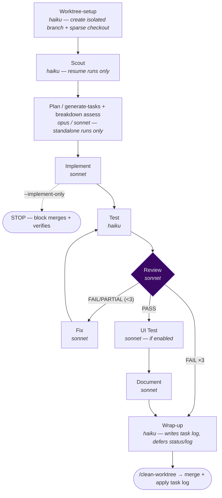

# `/sdlc-task` — parallel-safe single-task pipeline

A parallel-safe variant of [`/sdlc-run`](sdlc-run.md) that (1) auto-creates a git **worktree** for one
specific task, (2) runs the full pipeline inside it, and (3) **defers** `status.md`/`log.md` updates to a
task-log file applied at merge time. Because nothing shared is written during the run, many tasks can
execute simultaneously in separate sessions with zero merge conflicts.

It is also the **building block** `/sdlc-block` uses for genuinely-parallel waves (via `--implement-only`).

Engine: [`.claude/workflows/sdlc-task.js`](../../.claude/workflows/sdlc-task.js)

---

## Usage

```
/sdlc-task <spec-slug> 2                  run task 2 in an isolated worktree (full pipeline)
/sdlc-task <spec-slug> 2 --resume         reuse the EXISTING task-2 worktree (don't suffix-increment)
/sdlc-task <spec-slug> 2 --implement-only worktree-setup → implement → STOP (no test/doc/wrap-up/merge)
/sdlc-task <spec-slug> 2 --implement-only --review  ... plus ONE non-gating localization-map review pass
```

| Argument | Meaning | Default |
|---|---|---|
| `<spec-slug>` | **Required.** The spec directory name. | — |
| `N` | **Required.** Task number — scopes every stage and prefixes reports `taskN-`. (For full-spec runs use `/sdlc-run`.) | — |
| `--resume` | Reuse an existing `trees/<branch>` (or re-attach an orphan branch) instead of creating a fresh suffixed worktree, so the scout continues the interrupted pipeline. `/sdlc-block` sets this automatically for `partial-post-implement` tasks. | off |
| `--implement-only` | Run worktree-setup → implement, then **STOP**. No test/review/document/wrap-up, no merge. The lean `/sdlc-block` width-≥2 path ([D23](../../planning/decisions/D23-lean-block-shared-setup.md)). | off |
| `--review` | Only with `--implement-only`: add **one** review pass as a non-gating localization map (no fix loop). | off |

---

## Pipeline



The stages are identical to `/sdlc-run` (see [that page](sdlc-run.md#pipeline) for per-stage detail),
with three differences:

| Difference | `/sdlc-task` behavior |
|---|---|
| **Worktree-setup** (extra first stage) | Creates `trees/<branch>/` on a dedicated branch via cone-mode sparse checkout, reports whether the spec exists + block status (so a fresh run can skip Scout), and runs the [D19](../../planning/decisions/D19-property-based-authoring-guard.md) thin-spec guard. |
| **Wrap-up** | Runs on **haiku**; writes a `task<N>-log.md` instead of touching `status.md`/`log.md`. Those are applied later by `/clean-worktree`. |
| **Plan / breakdown assess** | Only on standalone runs; **suppressed** under `/sdlc-block` (the block assesses breakdown once for the whole spec). |

Everything else — the retry loop (max 3), staged `opus` escalation on the final fix/review, the two hard
gates, the commit prefixes — matches `/sdlc-run`.

---

## What runs where

| Lands on the worktree branch | Lands on `main` (at merge) |
|---|---|
| all code, content, doc changes | `status.md` update |
| all report files | `log.md` entry |

The wrap-up writes a structured `task<N>-log.md` carrying the deferred status/log edits with an
`Applied: false` flag. `/clean-worktree` reads it, applies each section, flips `Applied: true`, and
commits — so the human-facing prose lands exactly once, on `main`, in order.

---

## Worktree naming

Derived deterministically from the spec slug + task number:

```
spec slug: my-feature   task: 2
branch:    my-feature-task2
directory: trees/my-feature-task2/
```

If that name is taken, setup auto-increments a suffix (`-2`, `-3`, … capped at `-10`) — **unless**
`--resume` is set, in which case the existing worktree is reused verbatim (or an orphan branch
re-attached). The final branch name is always printed and written to the task log; pass it exactly to
`/clean-worktree`.

### Sparse checkout
The worktree uses git **cone-mode** sparse checkout so it materializes only the project's tracked
directories (plus all root-level files, auto-included by cone mode). The include set is derived
**dynamically** — `git ls-tree HEAD --name-only -d` cones **all tracked top-level directories**, so the
worktree adapts to any project layout with no stack assumptions (per
[D5](../../planning/decisions/D5-okf-phase-2-adopted.md) P5, matching `/init-worktree`).

---

## Merge flow — `/clean-worktree`

```mermaid
sequenceDiagram
    participant T as Task session (trees/&lt;branch&gt;/)
    participant M as Main session
    T->>T: full pipeline → task&lt;N&gt;-log.md (Applied: false)
    M->>M: /clean-worktree &lt;branch&gt;
    M->>M: show uncommitted changes / unpushed commits
    M->>M: git merge --ff-only &lt;branch&gt;
    M->>M: read task log → apply status.md + log.md → Applied: true → commit
    M->>M: git worktree remove + branch -D
```

Merge **in ascending task-number order** when running several in parallel — each task log's "next up is
task N+1" line keeps Current focus accurate only if applied in order. If `main` advanced since the
worktree was created, `--ff-only` fails cleanly and the worktree is left intact (rebase / merge-commit
options are printed).

> Do **not** run `/clean-worktree` for tasks driven by `/sdlc-block` — that orchestrator merges each wave
> for you.

---

## Parallel execution

```
Main session         Session A (trees/my-feature-task8/)   Session B (trees/my-feature-task9/)
────────────         ──────────────────────────────────    ──────────────────────────────────
                     /sdlc-task my-feature 8                /sdlc-task my-feature 9
                     ... running ...                        ... running ...
                     ← task 8 done                          ← task 9 done
/clean-worktree my-feature-task8   (merge 8 FIRST)
/clean-worktree my-feature-task9   (then 9)
```

If the spec is still `Not started`, run `/start-block <spec>` from the main session first so every
worktree's scout sees `In progress`.

---

## When to use it

- Running **multiple tasks at once**, each in its own session.
- **Risky/experimental** work where you want `main` clean until the branch is reviewed and merged.
- As the **`--implement-only` building block** under `/sdlc-block` for width-≥2 waves (you never invoke
  this form by hand).

Reach for [`/sdlc-run`](sdlc-run.md) when you don't need isolation; reach for
[`/sdlc-block`](sdlc-block.md) to orchestrate a whole spec (it calls this engine for you).

---

## Token usage

`sdlc-task.js` is instrumented (`tracedAgent` emits per-stage token deltas into the workflow report).

| Stage | Model | Typical tokens |
|---|---|---|
| worktree-setup | haiku | _TBD_ |
| scout (resume only) | haiku | _TBD_ |
| implement | sonnet | _TBD_ |
| test | haiku | _TBD_ |
| review | sonnet | _TBD_ |
| fix (per pass) | sonnet | _TBD_ |
| document | sonnet | _TBD_ |
| wrap-up | haiku | _TBD_ |
| **Full run (one task, PASS first try)** | — | _TBD_ (~7–9 agents) |
| **`--implement-only`** | — | _TBD_ (worktree-setup + implement [+ review]) |

Measured reference point (from the telemetry-pass work, `bastion`): after the [D8](../../planning/decisions/D8-implement-completeness-self-check.md)
completeness self-check landed, a task's review attempts dropped 2 → 1 and per-task out-tokens fell
~57K → ~36K (~37%). Under a parallel (width-≥2) wave the per-stage `tok` cell shows an estimated **input**
cost rather than a contaminated output delta ([D12](../../planning/decisions/D12-parallel-outtok-contamination.md)/[D15](../../planning/decisions/D15-parallel-telemetry-relabel.md)).
