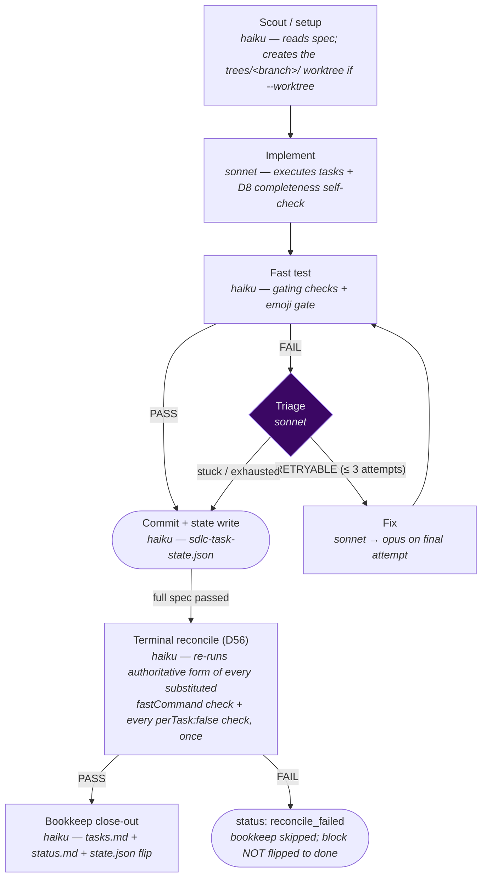

# `/sdlc-task` — lean single-unit SDLC engine

The fast path for **one small unit of behavior-changing work**. Runs
`implement → fast-test → triage → fix (≤3 attempts, Opus on the final) → commit → terminal
authoritative reconcile (D56 (`planning/decisions/D56-sdlc-task-authoritative-reconcile.md`))`,
in-place on the current branch by default, or in an isolated `--worktree` — see
[In-place vs. `--worktree`](#in-place-vs-worktree).

Think of it as the middle rung of the pipeline ladder — more ceremony than `/patch` (real test
loop), less than `/sdlc-flow` (no review/document/wrap-up agents). Pairs with `/chore` and
`/ticket`.

Engine: [`.claude/workflows/sdlc-task.js`](../../.claude/workflows/sdlc-task.js)

---

## Quickstart

A **Claude Code slash command** — type it into a Claude Code session, not a terminal.

```
/sdlc-task fix-verbose-flag              # run the whole spec, in place on the current branch
/sdlc-task fix-verbose-flag 2            # just task 2
/sdlc-task fix-verbose-flag --worktree   # isolated checkout under trees/
```

| Must exist first | If it doesn't |
|---|---|
| `planning/fix-verbose-flag/tasks.md` | Run `/ticket` or `/chore`, then `/generate-tasks`. |
| A configured `planning/harness.json` | See `docs/harness-json.md` — with no config the engine falls back to the spec's `## Validation Commands`. |

There is **no review, docs or PR stage** here by design. If you want those, use
[`/sdlc-flow`](sdlc-flow.md). Full flag reference below.

## Usage

```
/sdlc-task <spec-slug>                     run the whole spec in-place on the current branch
/sdlc-task <spec-slug> 1-3                 scope to tasks 1 through 3
/sdlc-task <spec-slug> --resume            re-attach existing state + continue
/sdlc-task <spec-slug> --test-depth full   full gating suite per task (default: fast)
```

Default is in-place on a plain branch (cheaper); pass `--worktree` for true isolation — see
[In-place vs. `--worktree`](#in-place-vs-worktree) below.

| Argument | Meaning | Default |
|---|---|---|
| `<spec-slug>` | **Required.** The spec directory name — drives every `planning/<spec-slug>/…` path. | — |
| `[range]` | Optional task selection (positional or `--tasks`). Forms: `1-3`, `1,3,5`, `5`. | all tasks |
| `--worktree` | Isolated `trees/<branch>/` checkout — see [In-place vs. `--worktree`](#in-place-vs-worktree). | in-place |
| `--resume` | Re-attach and continue from the last committed state. | off |
| `--test-depth fast\|full` | Per-task validation depth. `fast` runs only `gates:true` checks (the tripwire) via each check's `fastCommand`; `full` runs the whole suite (authoritative `command`) per task, which also skips the terminal reconcile stage — see [Terminal authoritative reconcile (D56)](#terminal-authoritative-reconcile-d56) below. Unlike `/sdlc-flow`, there is no `harness.json` config key for this — CLI-flag-only, default `fast`. | `fast` |

---

## Pipeline



| Stage | Model | What it does |
|---|---|---|
| **Scout / setup** | haiku | Reads the spec and existing report state (for `--resume`). In-place by default; with `--worktree`, creates (or re-attaches on `--resume`) a `trees/<branch>/` cone-mode sparse-checkout worktree — see [In-place vs. `--worktree`](#in-place-vs-worktree) above. Resolves the spec source (D65 stage 2): checks `planning/blocks/<BlockID>.json` first and prefers it when present; falls back to the legacy `planning/<spec>/tasks.md` only when no block record exists. `specSource` (`'block-record'` / `'tasks-md'` / `'missing'`) drives which file the run treats as the spec and, downstream, which D16 derive branch fires (see below). The D19 thin-spec check runs only when `specSource == 'tasks-md'`. |
| **Implement** | sonnet | Executes every task (or the selected range) against `tasks.md` (and `breakdown.md` if present). Runs the D8 (`planning/decisions/D8-implement-completeness-self-check.md`) completeness self-check before committing `feat:`/`fix:`. |
| **Fast test** | haiku | Runs the `gates:true` checks from `harness.json` plus the universal emoji gate on changed markdown. Falls back to the spec's `## Validation Commands` if no config. |
| **Triage** | sonnet | Classifies a failing test as `RETRYABLE` (transient, or failure changed — progress is possible) or stuck (same criteria twice, or structural). Before asserting a pre-existing/baseline claim, the failing check must be re-run against base state (`evidence` + `baseStateChecked` fields record this); otherwise the claim must be phrased as an explicit hypothesis. Harness-created workspace state is a candidate cause, not a fixed backdrop. Stuck → commit the current state as `FAIL` and exit, **appending** one entry to `state.bails[]` (`occurred_at, task_id, check_id, failing_artifact, ownership, bail_class, reason, resolution: null`) rather than only overwriting `bail_reason` — see BT.ticket.bails-must-be-append-only (`planning/blocks/BT.ticket.bails-must-be-append-only.json`). A resumed run merges the prior snapshot's `bails[]` forward instead of re-initialising it, so a bail that is later retried cleanly is annotated (`resolution: "resumed-clean"`), never erased. |
| **Fix** | sonnet | Targeted fix for the failing checks only — never a re-implement. Escalates to `opus` on the final attempt (`ESCALATION_MODEL`). |
| **Commit + state** | haiku | Writes `sdlc-task-state.json` (per-task status + token usage) and commits all work + state: in-place, one final `chore:` commit; under `--worktree`, a per-phase-write commit shape on the throwaway branch. |
| **Terminal reconcile** (D56 (`planning/decisions/D56-sdlc-task-authoritative-reconcile.md`)) | haiku | Runs once, after every task has passed on a full spec run, before bookkeep. See [Terminal authoritative reconcile](#terminal-authoritative-reconcile-d56) below. |
| **Bookkeep close-out** | haiku | Runs only on a full, fully-passing spec run **whose terminal reconcile also passed** (never on a partial task range, a bail, or a `reconcile_failed` run). Marks `tasks.md` tasks done using the spec's **cumulative** completed-task count (this run's passes reconciled with every prior run's, never this run's slice alone), appends (never rewrites) a "Current focus" line in `status.md` — see [Bookkeep's `status.md` and `focus.next` rules](#bookkeeps-statusmd-and-focusnext-rules) below — and flips `planning/state.json`'s block status to `"closed"`. In-place: also runs `mev emit-state --write`, which re-derives `focus.next`, then — if `planning/harness.json` names an optional `postEmitCommitCommand` — runs that hook (see [below](#bookkeeps-statusmd-and-focusnext-rules); absent key is a no-op). `--worktree`: skips `emit-state` (unsafe in a linked worktree), and therefore the hook too — `focus.next` stays **deferred**, still pointing at the pre-close state, until `/clean-worktree` (or an equivalent merge step) lands the branch and runs `mev emit-state --write`; the engine's own log line says so explicitly rather than leaving it silently stale. Writes no prose `log.md` entry — run `/log-work` for the narrative. (D50 (`planning/decisions/D50-sdlc-engines-flip-block-status-on-close.md`)) |

### The retry loop

`implement → fast-test →` **PASS: commit** or **FAIL: triage →** `RETRYABLE: fix → test`
(up to **3 total attempts**). The final fix attempt escalates to `opus`. After 3 failures or a
stuck triage verdict, the engine commits the current state and exits cleanly with a `FAIL`
status.

### `expect_red` — a task whose deliverable is a deliberately-failing test (D68)

A task in `tasks.json` may carry `"expect_red": ["<command>", ...]` — one or more commands
that MUST also appear in that same task's own `validation_commands`. This exists for the D68
shape: a task whose declared deliverable is a test *observed failing* (e.g. writing a fixture
against the unmodified code, per D68's own discipline) can never close under the ordinary rule,
where any non-zero exit fails the task. Each named command has its verdict **inverted** —
it **passes on a non-zero exit** and **fails on exit 0** — while every other check on that
task's list (including every project-wide `gates:true` harness check) is judged normally.

The boundary is enforced in the engine, not only documented: `expect_red` is scoped strictly to
a task's own `validation_commands`. An entry naming a command absent from that list is rejected
at enumerate time as a hard spec error (`ABORTED (spec error)`), never silently ignored — this is
what stops `expect_red` from ever becoming a way to invert or skip a harness gating check. A
task with no `expect_red` is unaffected; the field is optional and additive.

---

## D16 preflight — derive, then abort

The Plan stage's D16 (`planning/decisions/D16-preflight-task-structure-lint.md`) lint
enumerates tasks from `tasks.json`, not `tasks.md` — every downstream stage (fast test, triage,
fix, commit) walks that array. The preflight is **derive-then-abort**, not a bare abort:

1. **Enumerate.** Parse `planning/<spec>/tasks.json`. If it's a non-empty bare array, proceed
   normally.
2. **Derive.** If `tasks.json` is missing, invalid, or empty, the derive branch taken depends on
   the `specSource` resolved during Scout / worktree-setup (D65 stage 2):
   - `specSource == 'block-record'` — an `opus` recovery generator derives a fresh
     D45 (`planning/decisions/D45-tasks-json-orchestrator-schema-alignment.md`)-shaped
     `tasks.json` (bare array, integer `task_id`, single-string `description`, no `status`/
     `attempt_count`) directly from `planning/blocks/<BlockID>.json`, writes it, and commits it
     (`chore: derive tasks.json from block record (D16 fallback)`).
   - `specSource == 'tasks-md'` (the legacy path) — if `tasks.md` carries a usable step
     decomposition, the same recovery generator derives the D45-shaped `tasks.json` from the
     prose instead, writes it, and commits it
     (`chore: derive tasks.json from tasks.md (D16 fallback)`).

   Either branch re-runs Enumerate against the derived file once written.
3. **Abort.** Only when nothing was derivable either — no block record and no `tasks.md`, or a
   `tasks.md` with no extractable step structure — does the engine log `ABORTED (D16) — <path> is
   missing, invalid, or is an empty array.` and return without touching the tree. D16 exists to
   refuse *guessing* a task structure out of nothing; deriving from an authored block record or
   `tasks.md` is not guessing, so the abort survives only the genuinely underivable case.

`/sdlc-flow` runs the same derive-then-abort shape, but its D16 derive branch is `tasks.md`-only —
it does not derive from a block record — see [its Enumerate stage](./sdlc-flow.md#pipeline).

---

## Terminal authoritative reconcile (D56)

`/sdlc-task`'s per-task fast tripwire always runs with `gatingOnly: true` — it runs a check's
`fastCommand` instead of its authoritative `command` when the two differ, and it drops
`perTask: false` gating checks from the per-task loop entirely (they're meant to run once per
spec, not once per task). Before D56 (`planning/decisions/D56-sdlc-task-authoritative-reconcile.md`),
nothing in the engine ever ran those authoritative forms — not at the end, not on the last task,
not in bookkeep. `/sdlc-task` is `/ticket` and `/chore`'s default lane, so any `harness.json`
check that leans on a narrow `fastCommand` (e.g. D55 (`planning/decisions/D55-all-targets-clippy-placement.md`)'s
`cargo clippy --all-targets` placement) or a `perTask: false` build/integration check shipped with
that coverage silently invisible in this lane.

**When it runs.** Once, after the last task in a **full** spec run passes its per-task tripwire
(`testDepth === 'fast'`) and before bookkeep. It does **not** run on a partial task-subset run
(`/sdlc-task <slug> 1`) — the existing `fullRun` guard gates it, unchanged. It does not run under
`--test-depth full` either, since every per-task check already ran its authoritative `command` in
that mode — reconciling again would be a pure double-run.

**What it covers.** Only the checks the per-task loop actually skipped or substituted, reusing
`sdlc-flow.js`'s existing `renderCheckList(cfg, { gatingOnly: false, ... })` idiom rather than a
second one:
- every `gates: true` check whose `fastCommand` differs from `command` — reconciled with its
  authoritative `command`;
- every `gates: true, perTask: false` check — reconciled once (it never ran per-task at all).

Checks with no `fastCommand` are **not** re-run — they already ran their authoritative `command`
on every per-task tripwire, so reconciling them again would add cost for zero new coverage. A
project whose `harness.json` has no `fastCommand`/`perTask: false` checks pays zero added cost —
the reconcile's filtered check list is empty and the step is skipped with a log line.

**What it costs.** Measured on real repos (see
`measurement.md` (`planning/archive/ticket-sdlc-task-has-no-authoritative-gate/measurement.md`) and
D56 (`planning/decisions/D56-sdlc-task-authoritative-reconcile.md`)'s cost table): well under
2% of a typical spec's total wall-clock on both repos where a full number could be obtained
(≈0.4% on `bella`, ≤1.8% even on `engine-rs`'s incomplete worst-known measurement). There is no
flag or `harness.json` knob to disable it — D56 made it default-on and unconditional, on the
reasoning that a default-off knob is how this exact blind gate happened in the first place, and
that the measured cost does not justify protecting a per-spec budget.

**Failure path.** `/sdlc-task`'s fix loop is per-task and is already finished by the time the
reconcile runs, so a failing reconcile is never retried against a fix attempt. Instead:
1. The engine writes a distinct terminal status, `"reconcile_failed"`, to `sdlc-task-state.json`,
   with the raw failing command output preserved for the operator.
2. Bookkeep's done-path is **skipped entirely** — `tasks.md` is not marked done, the
   `status.md` Progress row is not flipped, and `planning/state.json`'s block status is not
   flipped to `"closed"`. The block is left in-progress with the failure surfaced.
3. All per-task commits already made stand — code is not reverted; only the "the spec is
   finished" claim is withheld.
4. To recover: fix the surfaced failure, then either re-run `/sdlc-task <slug> --resume` (every
   task is already `"passed"` in state, so it re-runs *only* the reconcile, not the whole task
   loop) or drive the fix manually with `/fix`.

Anything that reads `sdlc-task-state.json`'s `status` field (dashboards, `/status`,
`mev emit-state`) must treat `"reconcile_failed"` as a distinct non-terminal-success state — never
folded into `"done"` or an ordinary per-task `"bailed"`. For the complete, enumerable vocabulary of
every terminal `status` value the SDLC engines write (not just this one), what each means, and
what a consumer must not fold it into, see
[`docs/data-contract.md`](../data-contract.md) — that page, not this paragraph, is the surface a
Rust or Python consumer should pin against.

See D56 (`planning/decisions/D56-sdlc-task-authoritative-reconcile.md`) for the full design
rationale, the rejected alternatives, and the measured cost tables.

---

## Bookkeep's `status.md` and `focus.next` rules

Bookkeep's `status.md` edit is **append-only** narrative, not a section rewrite. It adds exactly
one new line under "Current focus" recording this run's outcome — the previous block's narrative
line(s) must survive the edit **verbatim**. The one exception: if an existing line already refers
to *this same spec* by name (e.g. left over from an earlier partial run of the same spec), that one
line may be replaced in place — never any other line, and never the whole section. This exists
because `status.md` is accumulated human-facing history (tens of KB in a mature repo); a full-section
replacement silently destroys everything a prior block recorded.

The completed-task count bookkeep writes (both into `tasks.md`'s markers and into the `status.md`
line above) is always the spec's **cumulative** total — every task marked done across every run of
this spec so far, not just this run's `passedTasks` slice. On a spec resumed after a partial run
(e.g. `/sdlc-task <slug> 1` followed later by `/sdlc-task <slug> 2`), the count reported after the
second run reads the true "N of M" total, not "1 of M" for whichever slice ran last. A partial
task-range run still leaves the block open regardless of what the count reads — but **since
2026-08-20 that is no longer the `fullRun` proxy's doing.** `blockDone` is now derived from
`outstandingTasks` (every task in `allTasks` not yet passed), so a `--resume` that lands the final
outstanding task **does** close the block, while a genuine subset run that leaves work outstanding
does not. The old condition asked "was a selection passed?", which left every completed resume
`open` — measured four for four. `fullRun` survives, but only to gate the terminal reconcile stage
(above); it no longer gates the close. Two things make this safe: `state.tasks` now survives a
`--resume` (it used to be overwritten, not merged), so the condition does not lean on the
git-derived scout that D37 (`planning/decisions/D37-unified-committed-state-and-telemetry.md`)
says must never be load-bearing alone; and the comparison is scoped to `allTasks`, not to the
selected `taskList` — against `taskList` it would be trivially true on every subset run. Both
properties are pinned by `scripts/test_block_close_decision.py` and
`scripts/test_resume_task_state_merge.py`, each of which also proves the pre-fix rule loses.

`planning/state.json`'s top-level `focus` object (`focus.next` in particular) is derived, not
bookkeep's to hand-edit — it's recomputed by `mev emit-state --write`. **In-place** runs execute
that command as part of bookkeep, so `focus.next` is current by the time the run finishes.
**`--worktree` runs skip it** (running `mev emit-state --write` from inside a linked worktree is
unsafe), so `focus.next` is left pointing at the pre-close state after the branch's own commits —
this is a deliberate deferral, not a bug, and the engine's own log line states it explicitly
(`"focus.next is DEFERRED — it still points at the pre-close state until /clean-worktree or
/clean-worktree runs mev emit-state --write."`) rather than silently leaving it stale. Since
`--worktree` is the default mode for isolated `/sdlc-task` runs, treat a freshly-merged worktree
branch's `focus.next` as stale until the merge step (`/clean-worktree`) has run
`mev emit-state --write` on the base.

**Optional post-emit commit hook** (`postEmitCommitCommand`,
`planning/blocks/BT.ticket.bookkeep-leaves-derived-output-uncommitted.json`, internal — `planning/`
is a gitignored symlink and does not resolve for a public reader):
after an in-place `mev emit-state --write` succeeds, bookkeep runs the shell command named by
`planning/harness.json`'s optional `postEmitCommitCommand` key, if present — this is how a repo
that wants the derived fallout (focus caches, wave tables, status boards) committed on close can
opt in, without the engine knowing or caring what the command does or where it lives. No default
ships and the scaffold stub never carries the key, so an absent key leaves every repo's behaviour
exactly as before this hook existed. It never runs in `--worktree` mode, and never when
`emitStateRan` is false for any other reason (`mev`/`brain.toml` absent) — it follows that same
flag rather than a second gate of its own. A non-zero exit is reported (`postEmitHookRan=true`,
`postEmitHookFailed=true`, with the command's output tail in the run notes) and never swallowed,
but it does not block or roll back this stage's own commit — the hook owns its own transaction.

---

## Validate-then-commit contract for `state.json`

Bookkeep's `state.json` block-status flip is never a bare `json.dump` + commit. `json.load()`
succeeding only proves the file is well-formed JSON — it is not schema validity. `mev`
deserializes `state.json` into typed structs, so a scalar where a struct belongs (e.g. a string
`origin` where the schema types it as `{type, slug}`) parses fine and fails deserialization for
the **whole file**. That exact shape mismatch happened 2026-08-09, produced `E_STATE_MALFORMED_JSON`
plus 30 cascading errors, and blocked every other repo's push gate — the incident this contract
exists to prevent from recurring. `sdlc-flow.js`'s wrap-up equivalent follows the identical
contract below — neither of the two surviving engines is excluded.

**What runs, in order:**

1. Read `planning/state.json` and keep its **pre-write bytes** verbatim, before mutating anything.
2. If `mev` is on `PATH`: run `mev validate-brain --state`, capturing its `E_`/`W_` diagnostic
   lines as the pre-write baseline.
3. Mutate the block's `status` field in memory and write it (`json.dump(..., ensure_ascii=False)`
   plus a trailing newline — never `ensure_ascii=True`, which escapes every em dash and turns a
   3-field edit into ~130 lines of unrelated churn).
4. Run `mev validate-brain --state` again and diff its output against the baseline.

**What "validated" means — delta, not absolute count.** The write is rejected only if it
introduces diagnostic lines **not present in the pre-write baseline**. Pre-existing corpus errors
(a sibling lane's unrelated breakage, a stale warning) never block this write — the same
delta-attribution rule the push gate uses under D64. A run never fails because the corpus was
already red before it started.

**Rejection is byte-exact rollback, and it surfaces.** If net-new diagnostics appear, `state.json`
on disk is overwritten back to the exact pre-write bytes captured in step 1 — never re-derived,
never "close enough." The block is **not** flipped to `closed` this run even if every task passed;
it stays open until a clean write lands on a later run. The rejection is never silent: the engine
logs `state.json: write REJECTED — net-new schema error(s) from mev validate-brain --state; rolled
back byte-exact, block NOT closed this run`, and the offending diagnostic lines are copied into the
stage's notes.

**`mev` absent degrades to a stated warning, not a run failure.** If `mev` is not on `PATH`, the
write lands unchecked (`json.load`-level parsing only, matching how the harness treats other absent
tooling) and the engine logs it explicitly as `UNVALIDATED: mev not available, json.load-level
parse only` — never presented as if the schema check ran.

**Worktree mode is decided, not deferred.** `mev validate-brain --state` reads
`planning/state.json` directly from the current working tree — it needs none of the cross-repo
`BRAIN_ROOT` resolution that makes `mev emit-state --write` unsafe inside a linked worktree. So
this validation step runs **the same way** whether `/sdlc-task --worktree` or in-place: it is never
deferred to merge. Only the separate `mev emit-state --write` regeneration of derived surfaces
(`focus.next`, wave tables) is deferred to merge time in worktree mode — a different step, on
purpose (see [Bookkeep's `status.md` and `focus.next` rules](#bookkeeps-statusmd-and-focusnext-rules)
above).

**Verified by fixtures, not by observing this spec's own run.** `scripts/test_state_write_validation.py`
reproduces the 2026-08-09 payload (a string `origin` where the schema wants a struct) and asserts
it passes `json.load` while being rejected by `mev validate-brain --state` — the contrast that is
the whole point of this contract — plus byte-exact rollback, surfaced rejection, delta-only
gating against a pre-reddened fixture corpus, worktree behavior, and the mev-absent degrade.
Registered `gates: true` in `planning/harness.json`.

---

## Committed state

`/sdlc-task` writes a committed `sdlc-task-state.json` under `planning/<spec>/sdlc/`:

```json
{
  "spec_slug": "ticket-login-fix",
  "status": "done",
  "tasks": [
    { "task": 1, "status": "pass", "tokens": { "implement": 45000, "test": 1200, "total": 46200 } }
  ],
  "bail_reason": null,
  "bails": [],
  "tokens": { "total": 46200 }
}
```

In-place mode: written once, swept into the final `chore:` commit alongside `status.md` and
`log.md` updates. `--worktree` mode: written per-phase, committed to the worktree branch and
applied at `/clean-worktree` merge time.

`bails[]` is append-only — one entry per bail (`occurred_at, task_id, check_id, failing_artifact,
ownership, bail_class, reason, resolution`), never truncated or overwritten; `bail_reason` stays as
a plain mirror of the newest entry's `reason`, null when `bails` is empty. `resolution` starts
`null` and is set to `"resumed-clean"` when a later `--resume` carries an open entry forward and
that task then passes. See
BT.ticket.bails-must-be-append-only (`planning/blocks/BT.ticket.bails-must-be-append-only.json`).

> **Token roll-up note:** `tokens.total` covers substantive stages (implement, test, fix).
> Cheap Haiku helper agents are excluded. See D37 (`planning/decisions/D37-unified-committed-state-and-telemetry.md`).

---

## Commit safety guard and GIT environment strip

Every commit-emitting recipe in `.claude/workflows/sdlc-task.js` (setup/worktree init, the D16
fallback commits, per-task + vault commits, bookkeep + vault commit — every site except the
`--allow-empty` worktree-init commit, which is intentionally empty) is `&&`-joined to a shared
`renderCommitSafetyGuard(gitCmd='git')` snippet before the `git commit` itself runs. The guard
refuses to commit when the staged index is empty against a non-empty `HEAD` — the failure mode
that otherwise lands a zero-file "passing" commit when a prior `git add` silently touched nothing
(e.g. a `GIT_INDEX_FILE` pointed at the wrong index). `sdlc-flow.js` defines a byte-identical copy
of the same helper; `scripts/test_commit_safety_guard.py` pins the two engines' text in agreement
and exercises the guard against a poisoned worktree, a clean control, a no-`HEAD` repo, and the
vaulted `git -C <vault>` call shape, and is registered as the gating `commit-safety-guard-tests`
check in `planning/harness.json`.

The guard above only catches a *totally* empty index. It does not catch a commit whose index is
non-empty but whose content is still wrong — a mass-deletion commit with one surviving file, for
instance, which is exactly the shape that shipped as a green PASS in EN.11.O (443 files changed,
177,867 deletions, zero insertions). `renderWorkAssertion(gitCmd='git', taskNum, tasksJsonPath)`
(D81 lift condition 2 — `BT.ticket.a-run-must-prove-its-commits-contain-the-work`) is the
complement: it runs immediately *after* the per-task work commit in both engines' per-task loop
(never before — it inspects the commit it is checking via `git diff --name-status HEAD~1 HEAD`),
reading `tasksJsonPath` at run time to get task `taskNum`'s declared `files[]`, and aborts
(`WORK_ASSERTION_ABORT`, nonzero exit) when: (1) the commit's diff is empty; (2) no changed path
intersects the declared `files[]`; (3) the commit **deletes** a path that is *not* declared — the
EN.11.O shape. Deleting a file the task *did* declare passes cleanly; deletion is not itself the
signal, undeclared deletion is. It is exempt — never invoked — at the worktree-init commit, the
D16 fallback commits, and the vault commit (a different repo, with its own `HEAD~1` and
`planning/`-prefixed paths, that other concurrent lanes also write to). `renderCommitSafetyGuard()`
itself is unchanged — the two guards are complements, not a replacement. `sdlc-flow.js` defines a
byte-identical copy; `scripts/test_work_assertion.py` pins the two engines' function source and
rendered snippet in agreement, reproduces the EN.11.O fixture to show it now fails the new guard
while still passing the old one unchanged, and is registered as the gating `work-assertion-tests`
check in `planning/harness.json`.

Separately, every executable `git` invocation in both engines' recipes is routed through a shared
`GIT` prefix constant — `env -u` of the nine `GIT_REPO_ENV_VARS` mev recognizes — so a
hook-inherited `GIT_INDEX_FILE`/`GIT_DIR`/etc. can no longer silently redirect a recipe's git
commands at the wrong index or repo. `scripts/test_git_env_strip.py` pins the constant's
byte-identity across both engines, the exact nine-variable list, and (via an allowlisted source
scan) that no executable git call site in either engine is left unprefixed; registered as the
gating `git-env-strip-tests` check.

---

## Vaulted `planning/` writes in the per-task loop

In a brain-vaulted repo, `planning/` is a relative symlink into a separate git repo — the vault —
so a plain `git add planning/...` from `${runDir}` fails with "pathspec is beyond a symbolic link"
(D46). Before this reached the per-task loop, only the bookkeep close-out knew how to work around
that: a task's own `planning/` writes (an ADR, a `measurement.md`, an edit to another spec's
`tasks.md`) went uncommitted at step 7's commit, invisible from the repo root, and the run still
reported PASS because the downstream harness checks observe **disk** state, not **index** state.

`detectPlanningVault(runDir)` now resolves the vault **once**, before the task loop starts, and
every stage below (the per-task commit, bookkeep) reuses that single resolved `vault` — never a
second detection call. The per-task loop then does two things, both driven off `filesModified`
rather than a fixed list of filenames:

- **Step 7b, after every implement/fix attempt.** If anything the attempt wrote lives under
  `planning/`, the agent stages and commits it through the real path
  (`git -C <vault.planningPath> add <vault.planningPath>/<relpath>`, then one
  `git -C <vault.planningPath> commit`) — deriving the exact set from what it actually wrote. It
  never issues `git add -A`, `git add .`, `git reset`, or `git stash` against the vault, and never
  checks out/switches/branches inside it, so a sibling lane's staged work already sitting in the
  vault repo is left staged and untouched. If nothing it wrote lives under `planning/`, it skips
  the step entirely.
- **Independent re-verification — never trust the self-report.** A live run of this ticket's own
  chain returned a perfectly valid `commitHash` that covered only the *source* half of a task, with
  the `planning/` half silently uncommitted; a non-empty hash proves nothing about the vault half.
  So after every attempt, the engine re-derives the vault-relevant subset of `filesModified` itself
  and hands it to a small Haiku agent that checks, directly against the vault repo, that each path
  is both tracked (`git -C <vault> ls-files --error-unmatch`) and free of any staged/unstaged diff
  (`git -C <vault> status --porcelain`) — i.e. actually landed in a commit there.

A failed or incomplete vault commit is fed through the same triage path as any other test
failure — `RETRYABLE` gets another fix attempt, a `MAJOR` verdict or attempt-exhaustion bails — so
the task is never reported passed while a `planning/` path it wrote sits uncommitted in the vault.
This is layered on top of, not a replacement for, the bookkeep close-out's own vault recipe (three
hard-coded paths: the spec's `tasks.md`, `status.md`, `state.json`) — both stages resolve the vault
through the same `detectPlanningVault` call and stage through the same `git -C <vault>` idiom, but
bookkeep still targets only its three bookkeeping files while the per-task loop covers whatever
`planning/` paths the task itself wrote.

When `planning/` is a real tracked directory (a non-vaulted repo), `vault.vaulted` is `false`, none
of the above fires, and everything commits together in the repo's own index exactly as before.

---

## In-place vs. `--worktree`

Default is **in-place**, on the current branch in the main working tree — cheaper, and keeps a
relative `planning/` symlink intact. Pass `--worktree` for true isolation: a second checkout under
`trees/<branch>/`, so an in-flight run cannot collide with other work on the main tree.

`--worktree` was suspended fleet-wide from 2026-08-23 to 2026-08-28 (brain decision
`D81-worktree-moratorium`) after three separate whole-repo-deletion incidents behind a GREEN run.
The moratorium was lifted after `BT.ticket.worktree-smoke-fixture` verified a real `--worktree`
run end to end and confirmed the guards added during the suspension hold: the binding/brain-root/
population guards below, `renderCommitSafetyGuard()` (refuses to commit an empty tree against a
non-empty HEAD), and the post-commit work assertion (D81 lift condition 2 —
BT.ticket.a-run-must-prove-its-commits-contain-the-work (`planning/blocks/BT.ticket.a-run-must-prove-its-commits-contain-the-work.json`)).
Full incident record: `agentic-portfolio/docs/decisions/D81-worktree-moratorium.md` (a sibling
repo's decision log, not part of this repo).

| | In-place (default) | `--worktree` |
|---|---|---|
| Branch | current branch (usually `main`) | `trees/<spec>-task/` sparse-checkout worktree |
| Status/log | updated on the current branch | updated on the worktree branch; merges in via `/clean-worktree` |
| State commit | one final `chore:` sweep | per-phase-write commit shape on the throwaway branch |
| When to use | every run by default | a change that genuinely needs quarantine from concurrent main-tree work |

A Rust repo whose manifest uses `path = "../<crate>"` needs its `trees/` sibling symlinks present
before a `--worktree` checkout is usable — see
[`worktrees-in-rust-repos.md`](worktrees-in-rust-repos.md) for why and how to check.

### Binding / brain-root / population guards (BT.ticket.worktree-setup-can-adopt-the-brain-root-as-repo-root)

Run immediately after the setup agent returns and before the enumerate/per-task stages — a
misbound or unpopulated checkout must never reach a task's implement stage. All three compare
against `repoRoot`, resolved once by `resolveRepoRoot()` before setup ever ran, never re-derived
by any later stage:

- **BINDING GUARD** — the run directory's `--git-common-dir` (absolute form) must resolve under
  `repoRoot`. On mismatch the engine aborts with `Setup binding guard failed`, naming both the
  run's git-common-dir and `repoRoot` — the check that catches a run silently adopting a different
  repo (e.g. the brain root) than the one the engine resolved.
- **BRAIN-ROOT GUARD** — if a `brain.toml` exists at the resolved run root but did not exist at the
  invocation root, the engine aborts with `Setup binding guard failed`, naming both roots. The
  signal is exactly this — brain.toml presence at two mechanical paths — never a harness-check
  count and never a hardcoded path.
- **POPULATION GUARD** (worktree mode only) — every path in the worktree's `git ls-files` index must be present on disk; a missing
  path aborts with `Setup binding guard failed`, naming the missing count and up to five example
  paths. This is the guard against a worktree that bound to the correct repo but never actually
  populated (the sparse-checkout-produced-zero-files symptom).

All three guards run in-place too (in-place sets `runDir = repoRoot` from the same engine-resolved
value, so it is subject to the same binding and brain-root checks; population is worktree-only by
definition). Each guard logs its verdict, pass or fail, so the transcript shows the check ran
rather than merely that nothing exploded.

---

## When to use it

Reach for `/sdlc-task` when:
- A `/chore` or `/ticket` planner just ran — both route here by default.
- The work is **small, self-contained, and needs real tests** — but doesn't warrant a full
  review/document/wrap-up cycle.
- You want the fast path: implement → test → commit, with a real fix loop.

| Engine | Reach for it when |
|---|---|
| `/patch` | Trivial hotfix with no tests needed |
| `/sdlc-task` | **Small tested change** — `/chore` or `/ticket` work |
| `/sdlc-flow` | Non-trivial feature work with a PR handoff |
| `/orchestrate` | Whole roadmap — one `/sdlc-flow` per block, branch train |

---

## Token usage

| Stage | Model | Typical tokens |
|---|---|---|
| scout / worktree-setup | haiku | _TBD_ |
| implement | sonnet | ~45–60k |
| fast test | haiku | _TBD_ |
| triage (per failure) | sonnet | ~4–6k |
| fix (per pass) | sonnet | _TBD_ |
| commit + state | haiku | _TBD_ |
| **Full run (one task, PASS first try)** | — | _TBD_ (~4–6 agents) |

Measured totals persist in the committed `sdlc-task-state.json` — check that file for
real figures from past runs.
